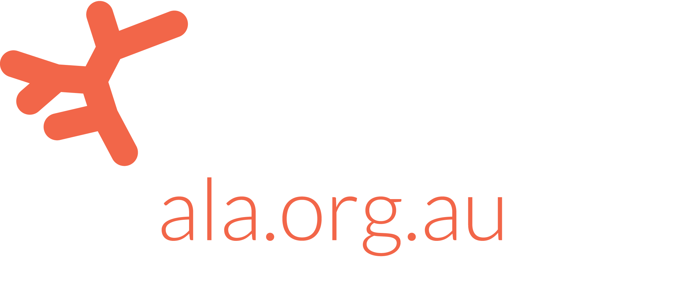

class: ALA-title-slide animated fadeIn


<br>
.main-title[<br><br><br>Improving the Atlas of Living Australia]<br>
.main-subtitle[for ecological researchers]<br>
.white[
  <b>Martin Westgate</b> | Matilda Stevenson | Corinna Paeper | Peggy Newman<br>
  <br>
  Ecological Society of Australia annual conference 2020
]
<br>
<br>


<br>
.small[The ALA is made possible by contributions from its many partners. It receives support through the Australian Government through the National Collaborative Research Infrastructure Strategy (NCRIS) and is hosted by CSIRO.]

---
class: ALA-standard-slide animated fadeIn
layout: true
background-image: url(img/ALA_Logo_Inline_RGB.png)
background-position: 90% 100%
background-size: 20%
---
.slide-title[Outline<br><br>]

.slide-title[Utility] .slide-subtitle[&nbsp;&nbsp;What is ALA used for?]<br><br>
.slide-title[Bias] .slide-subtitle[&nbsp;&nbsp;Your atlas needs you]<br><br>
.slide-title[Progress] .slide-subtitle[&nbsp;&nbsp;Where next for ALA?]


---
class: ALA-title-slide animated fadeIn
layout: false
.divider-text[<br><br><br>Utility]
<br>
.white[What is ALA used for?]
---
class: ALA-standard-slide animated fadeIn
layout: true
background-image: url(img/ALA_Logo_Inline_RGB.png)
background-position: 90% 100%
background-size: 20%

---

.slide-title[Utility]

```{r, stm_plot, echo=FALSE, fig.height=7, fig.width=13}
library(ggplot2)
library(viridis)
topic_frequencies <- readRDS("./data/stm_plot_data.rds")
ggplot(topic_frequencies, aes(x = label, y = count, fill = count)) +
  geom_bar(stat = "identity") +
  geom_text(aes(label = auto_keywords, y = count + 20),
    color = "grey50", size = 5, hjust = 0) +
  coord_flip() +
  labs(x = "Topic description", y = "Number of articles") +
  scale_fill_viridis(direction = -1, option = "magma") +
  ylim(c(0, 800)) +
  theme_bw() +
  theme(legend.position = "none",
    panel.grid.major.y = element_blank(),
    panel.grid.minor.y = element_blank(),
    axis.text = element_text(size = 16),
    axis.title = element_text(size = 16)
  )
```

---
class: ALA-title-slide animated fadeIn
layout: false
.divider-text[<br><br><br>Bias]
<br>
.white[Making ALA more representative]
---
class: ALA-standard-slide animated fadeIn
layout: true
background-image: url(img/ALA_Logo_Inline_RGB.png)
background-position: 90% 100%
background-size: 20%


---
.slide-title[Bias]&nbsp;&nbsp;.slide-subtitle[:: over space]

<div style="margin-top:-70px; margin-left:250px;">
```{r, bias_1, echo=FALSE, out.width="600px"}
map2 <- readRDS("./img/map2.rds")
map2
```
</div>

---
.slide-title[Bias]&nbsp;&nbsp;.slide-subtitle[:: over taxa]

```{r, bias_2, echo=FALSE, out.width="1000px", out.height="500px"}
library(plotly)
library(viridis)
library(ALA4R)
source("./R/make_circles.R")
source("./R/taxon_plotting.R")
counts <- ala_counts(breakdown = "kingdom")
taxon_data <- taxon_plot_data(counts$name, counts$count,
  log_scale = FALSE, linear = TRUE, color_scale = "magma")

# draw plot
p <- plot_ly(taxon_data,
  type = "scatter",
  mode = "lines",
  fill = "toself", # needed?
  source = "taxon",
  x = ~x,
  y = ~y,
  split = ~plotly_text,
  color = I(taxon_data$color),
  hoverinfo = "text",
  hoverlabel = list(
    bgcolor = grey(0.9),
    bordercolor = grey(0.9),
    namelength = 200,
    font = list(color = "black")
  ),
  width = 1000,
  height = 500
) %>%
add_polygons(
  hoveron = "fills",
  alpha = 1) %>%
layout(
  showlegend = FALSE,
  xaxis = list(
    title = "",
    zeroline = FALSE,
    showline = FALSE,
    showticklabels = FALSE,
    showgrid = FALSE
  ),
  yaxis = list(
    title = "",
    zeroline = FALSE,
    showline = FALSE,
    showticklabels = FALSE,
    showgrid = FALSE,
    scaleanchor = "x" # set aspect ratio =  1
  )
) %>%
config(
  displayModeBar = FALSE
)
p
```

---
class: ALA-title-slide animated fadeIn
layout: false
.divider-text[<br><br><br>Progress]
<br>
.white[Where next?]
---
class: ALA-standard-slide animated fadeIn
layout: true
background-image: url(img/ALA_Logo_Inline_RGB.png)
background-position: 90% 100%
background-size: 20%

---
.slide-title[Progress]&nbsp;&nbsp;.slide-subtitle[:: R integration]
```{r, r_eg_2, echo=TRUE, out.width=13}
# remotes::install_github("AtlasOfLivingAustralia/ALA4R@dev") # current version
library(ALA4R)
ala_config(email = "martinjwestgate@gmail.com")

# look up a species
taxon_id <- ala_taxa("Thylacine", include_counts = TRUE)
taxon_id
```

---
.slide-title[Progress]&nbsp;&nbsp;.slide-subtitle[:: R integration]
```{r, r_eg_3, echo=TRUE, fig.height=7, fig.width=13}
thylacine_records <- ala_occurrences(taxon_id)
thylacine_records[1:3, ]
```

---
.slide-title[Progress]&nbsp;&nbsp;.slide-subtitle[:: R integration]
```{r, r_eg_4, echo=TRUE, fig.height=5, fig.width=13}
library(ggplot2); library(ozmaps)
ggplot() +
  geom_sf(data = ozmap_data(data = "country")) +
  geom_point(data = thylacine_records[!is.na(thylacine_records[[1]]), ],
    mapping = aes(x = decimalLongitude, y = decimalLatitude),
    color = "#F26649", alpha = 0.7) +
  lims(x = c(110, 155), y = c(-45, -10)) +
  theme_void()
```

---
.slide-title[Progress]&nbsp;&nbsp;.slide-subtitle[:: R integration]
```{r, r_eg_5, echo=TRUE, fig.height=5, fig.width=13}
thylacine_sdm <- ala_occurrences(taxon_id,
  filters = ala_filters(data_quality_profile = "CSDM"))
ggplot() +
  geom_sf(data = ozmap_data(data = "country")) +
  geom_point(data = thylacine_sdm,
    mapping = aes(x = decimalLongitude, y = decimalLatitude),
    color = "#F26649", alpha = 0.7) +
  lims(x = c(110, 155), y = c(-45, -10)) +
  theme_void()
```

---
.slide-title[Progress]&nbsp;&nbsp;.slide-subtitle[:: where next?]

<table>
  <colgroup>
     <col span="1" style="width: 10%;">
     <col span="1" style="width: 30%;">
     <col span="1" style="width: 30%;">
     <col span="1" style="width: 30%;">
  </colgroup>
  <tbody>
    <tr>
      <th></th>
      <th style="background-color: #F26649">Interface</th>
      <th style="background-color: #f2866f">Cleaning</b></th>
      <th style="background-color: #f09f8d">Modelling</b></th>
    </tr>
    <tr>
      <th style="background-color: #F26649">Current problem</th>
      <td>
        Current interface emphasises <b><i>text search</i></b>, requiring the user to already know what they want; <b><i>browsing</i></b> can be inefficient, and is challenging using taxonomic names
      </td>
      <td>
        So far, the data quality project has focussed on <b><i>filtering</i></b> suspect records
      </td>
      <td>
        Statistical error detection relies on <b><i>outlier detection</i></b> in environmental space
      </td>
    </tr>
    <tr>
      <th style="background-color: #f2866f">Possible solution</th>
      <td>
        <b><i>Linked visualisation</i></b> of spatial and taxonomic data
      </td>
      <td>
        <b><i>Better links</i></b> between data providers and users
      </td>
      <td>
        Methods that incorporate <b><i>typographical, taxonomic and environmental similarity</i></b>
      </td>
    </tr>
  </tbody>
</table>

---

class: ALA-title-slide animated fadeIn
layout: false


.main-title[<br><br><br>Thank You]<br>

.white[
  <b>Martin Westgate</b> | Matilda Stevenson | Corinna Paeper | Peggy Newman<br>
  Atlas of Living Australia<br><br>
  <b>t:</b> +61 422 522 494<br>
  <b>e:</b> martin.westgate@csiro.au
  <br>
]
.small[
  These slides were made with R v4.0.2 | rmarkdown | xaringan | plotly | ggplot2 | viridis
]
<br>
<br>


<br>
.small[The ALA is made possible by contributions from its many partners. It receives support through the Australian Government through the National Collaborative Research Infrastructure Strategy (NCRIS) and is hosted by CSIRO.]