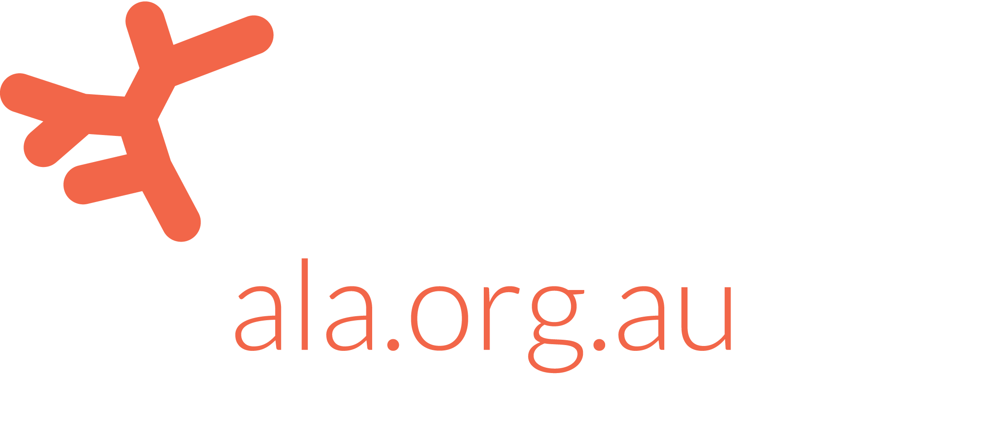
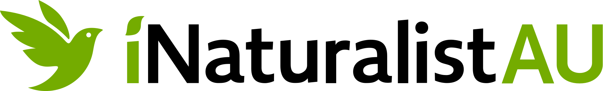
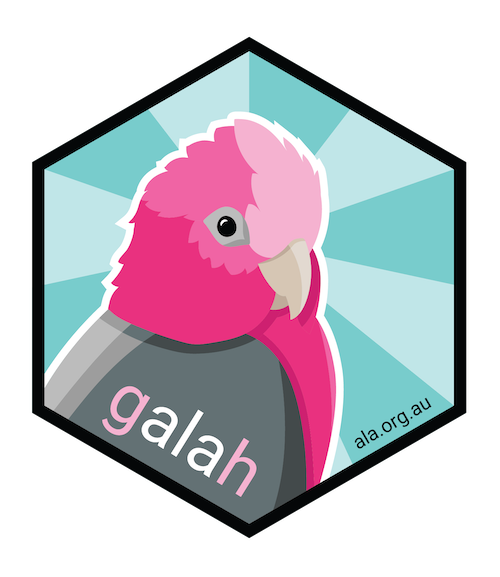

class: ALA-title-slide animated fadeIn


<br>
.main-title[<br><br><br>Improving the Atlas of Living Australia]<br>
.main-subtitle[for researchers]<br>
.white[
  <b>Martin Westgate</b><br>
  Team Leader | Science & Decision Support Team | ALA<br>
  Honourary Lecturer | Fenner School of Environment & Society | ANU<br>
  <br>
  Webinar Series | Dept. Ecology, Environment & Evolution | La Trobe University | 2021-07-26
]
<br>


<br>
.small[The ALA is made possible by contributions from its many partners. It receives support through the Australian Government through the National Collaborative Research Infrastructure Strategy (NCRIS) and is hosted by CSIRO.]

---
class: ALA-standard-slide animated fadeIn
layout: true
background-image: url(img/ALA_Logo_Inline_RGB.png)
background-position: 90% 100%
background-size: 20%
---
.slide-title[Outline<br><br>]

.slide-title[Identity] .slide-subtitle[&nbsp;&nbsp;What is the ALA?]<br><br>
.slide-title[Collaboration] .slide-subtitle[&nbsp;&nbsp;How can I contribute data to the ALA?]<br><br>
.slide-title[Usage] .slide-subtitle[&nbsp;&nbsp;How can I use the ALA?]<br><br>
.slide-title[Future] .slide-subtitle[&nbsp;&nbsp;Where next?]

---
class: ALA-title-slide animated fadeIn
layout: false
.divider-text[<br><br><br>Identity]
<br>
.white[What is the ALA?]
---
class: ALA-standard-slide animated fadeIn
layout: true
background-image: url(img/ALA_Logo_Inline_RGB.png)
background-position: 90% 100%
background-size: 20%
---

.slide-title[Identity]&nbsp;&nbsp;.slide-subtitle[who we are]

```{r, echo=FALSE, results="hide"}
## Number of records
# ala_counts()
## Calculate current number of providers in ALA:
# n_providers <- ala_counts(group_by = "dataResourceName", limit = NULL)
## dataProviderUid n = 50
# nrow(n_providers) # 816
```
<br><br><br>
.slide-title[Database] .slide-subtitle[&nbsp;&nbsp; 100,855,731 biodiversity observations (2021-07-28 09:00)]<br><br>
.slide-title[Network] .slide-subtitle[&nbsp;&nbsp; 816 data providers]<br><br>
.slide-title[Code] .slide-subtitle[&nbsp;&nbsp; 221 GitHub repositories]<br><br>
.slide-title[People] .slide-subtitle[&nbsp;&nbsp; 34 staff]<br><br>

---

.slide-title[Identity]&nbsp;&nbsp;.slide-subtitle[time]
```{r, echo=FALSE, fig.height=7, fig.width=13}
library(galah)
library(ggplot2)
library(viridis)
library(scales)

# get data
df <- ala_counts(group_by = "decade")
df$label <- factor(
  seq_len(nrow(df)),
  levels = seq_len(nrow(df)),
  labels = paste0(seq(1850, 2020, 10), "s"))
  
# plot
ggplot(df, aes(x = label, y = count, fill = as.numeric(label))) +
  geom_bar(stat = "identity") +
  geom_text(aes(x = label, label = label), 
    y = 1, angle = 90, color = "white", size = 6) +
  labs(x = "", y = "Number of new records") +
  scale_y_log10(
    breaks = trans_breaks("log10", function(x) 10^x),
    labels = trans_format("log10", math_format(10^.x))) +
  scale_fill_viridis(direction = -1, option = "magma", begin = 0.1, end = 0.9) +
  theme_bw() +
  theme(
    legend.position = "none",
    panel.border = element_blank(),
    panel.grid.major.x = element_blank(),
    panel.grid.minor.x = element_blank(),
    axis.text.x = element_blank(),
    axis.ticks.x = element_blank(),
    axis.title.x = element_blank(),
    axis.text.y = element_text(size = 16),
    axis.title.y = element_text(size = 16)
  )
  
```

---
.slide-title[Identity]&nbsp;&nbsp;.slide-subtitle[space]

```{r, echo=FALSE, fig.height=7, fig.width=14}
library(sf)
aus_grid <- readRDS("./data/aus_grid.rds")

# plot
ggplot(aus_grid, aes(fill = log10(n))) +
  geom_sf(color = NA) +
  labs(fill = "Number of\nrecords\n(* 10^x)") +
  scale_fill_viridis(
    limits = c(2, 7),
    direction = -1, 
    option = "magma", 
    begin = 0.1, 
    end = 0.9) +
  theme_void() +
  theme(
    legend.title = element_text(size = 16),
    legend.text = element_text(size = 16)
  )

```

---

.slide-title[Identity]&nbsp;&nbsp;.slide-subtitle[taxonomy]

```{r, echo=FALSE, fig.height=7, fig.width=13}
df <- ala_counts(group_by = "kingdom")
df <- df[order(df$count, decreasing = FALSE),]
df$kingdom <- factor(
  seq_len(nrow(df)),
  levels = seq_len(nrow(df)),
  labels = df$kingdom)

ggplot(df, aes(x = kingdom, y = count, fill = as.numeric(kingdom))) +
  geom_bar(stat = "identity") +
  geom_text(aes(x = kingdom, label = kingdom), 
    y = 0.2, hjust = 0, color = "white", size = 6) +
  coord_flip() +
  labs(x = "", y = "Number of records") +
  scale_y_log10(
    breaks = trans_breaks("log10", function(x) 10^x),
    labels = trans_format("log10", math_format(10^.x))) +
  scale_fill_viridis(direction = -1, option = "magma", begin = 0.1, end = 0.9) +
  theme_bw() +
  theme(
    legend.position = "none",
    panel.border = element_blank(),
    panel.grid.major.y = element_blank(),
    panel.grid.minor.y = element_blank(),
    axis.text.y = element_blank(),
    axis.ticks.y = element_blank(),
    axis.title.y = element_blank(),
    axis.text.x = element_text(size = 16),
    axis.title.x = element_text(size = 16)
  )
```

---

.slide-title[Identity]&nbsp;&nbsp;.slide-subtitle[applications]

```{r, echo=FALSE, fig.height=7, fig.width=13}
topic_frequencies <- read.csv("./data/topic_keywords_k10.csv")
topic_frequencies <- topic_frequencies[order(topic_frequencies$n, decreasing = FALSE),]
topic_frequencies$label <- factor(
  seq_len(10),
  levels = seq_len(10),
  labels = topic_frequencies$label)

ggplot(topic_frequencies, aes(x = label, y = n, fill = n)) +
  geom_bar(stat = "identity") +
  geom_text(aes(label = prob, y = n + 10, color = n),
    size = 6, hjust = 0) +
  geom_text(aes(x = label, label = label), 
    y = 10, hjust = 0, color = "white", size = 6) +
  coord_flip() +
  labs(x = "Topic description", y = "Number of articles") +
  scale_fill_viridis(direction = -1, option = "magma", begin = 0.1, end = 0.9) +
  scale_color_viridis(direction = -1, option = "magma", begin = 0.1, end = 0.9) +
  ylim(c(0, 800)) +
  theme_bw() +
  theme(
    legend.position = "none",
    panel.border = element_blank(),
    panel.grid.major.y = element_blank(),
    panel.grid.minor.y = element_blank(),
    axis.text.y = element_blank(),
    axis.ticks.y = element_blank(),
    axis.title.y = element_blank(),
    axis.text.x = element_text(size = 16),
    axis.title.x = element_text(size = 16)
  )
```

---
class: ALA-title-slide animated fadeIn
layout: false
.divider-text[<br><br><br>Collaboration]
<br>
.white[How can I contribute data to the ALA?]
---
class: ALA-standard-slide animated fadeIn
layout: true
background-image: url(img/ALA_Logo_Inline_RGB.png)
background-position: 90% 100%
background-size: 20%

---
.slide-title[Collaboration]&nbsp;&nbsp;.slide-subtitle[types of data]

```{r, echo=FALSE, results="hide"}
# distributionsdf <- jsonlite::fromJSON("https://spatial.ala.org.au/ws/distributions")
# nrow(distributionsdf)
```
<br><br><br>
.slide-title[Occurrences] .slide-subtitle[&nbsp;&nbsp; <a href="https://biocache.ala.org.au">biocache.ala.org.au</a> (n = 100,855,731)]<br><br>
.slide-title[Species lists] .slide-subtitle[&nbsp;&nbsp; <a href="https://lists.ala.org.au">lists.ala.org.au</a> (n = 2,040)]<br><br>
.slide-title[Expert distributions] .slide-subtitle[&nbsp;&nbsp; <a href="https://spatial.ala.org.au">spatial.ala.org.au</a> (n = 9,366)]<br><br>

---
.slide-title[Collaboration]&nbsp;&nbsp;.slide-subtitle[how to submit occurrence records]

.pull-left[
  <br><br>
  
]

.pull-right[
  <br><br><br><br>
  OR<br><br>
  .slide-title[Record] .slide-subtitle[&nbsp;&nbsp;your observations]<br><br>
  .slide-title[Convert] .slide-subtitle[&nbsp;&nbsp;to Darwin Core (https://dwc.tdwg.org)]<br><br>
  .slide-title[Email] .slide-subtitle[&nbsp;&nbsp;to <a href="mailto:support.ala.org.au">support.ala.org.au</a>]<br><br>
]

---

.slide-title[Collaboration]&nbsp;&nbsp;.slide-subtitle[error checking]

```{r, results="hide"}
find_profile_attributes("ALA")
```

```{r, echo=FALSE}
# library(xtable)
profiles <- find_profile_attributes("ALA")
# knitr::kable(profiles[, 2],
#   col.names = colnames(profiles)[2])
cat(paste(sort(profiles$filter), collapse = "\n"))
```
---

.slide-title[Collaboration]&nbsp;&nbsp;.slide-subtitle[spatial data]
```{r}
nrow(search_fields())
```


```{r, results="hide"}
search_fields("worldclim 2.1: Temperature")
```

```{r, echo=FALSE}
# knitr::kable(search_fields("worldclim 2.1")[, 1:2])
cat(paste(
  search_fields("worldclim 2.1: Temperature")$description,
  collapse = "\n"))
```


---

class: ALA-title-slide animated fadeIn
layout: false
.divider-text[<br><br><br>Usage]
<br>
.white[How can I use the ALA?]
---
class: ALA-standard-slide animated fadeIn
layout: true
background-image: url(img/ALA_Logo_Inline_RGB.png)
background-position: 90% 100%
background-size: 20%

---

.slide-title[Usage]
<br><br><br><br>
.slide-title[Biocache] .slide-subtitle[&nbsp;for occurrence records: <a href="https://biocache.ala.org.au">biocache.ala.org.au</a>]<br><br>
.slide-title[Biodiveristy Information Explorer] .slide-subtitle[&nbsp;for species-level information: <a href="https://bie.ala.org.au">bie.ala.org.au</a> ]<br><br>
.slide-title[Spatial Portal] .slide-subtitle[&nbsp;for online analysis: <a href="https://spatial.ala.org.au">spatial.ala.org.au</a> ]<br><br>
.slide-title[R] .slide-subtitle[&nbsp;for desktop analysis: <a href="https://cran.r-project.org">cran.r-project.org</a> ]<br><br>

---

.slide-title[Usage]&nbsp;&nbsp;.slide-subtitle[galah]
.pull-left[
  
]

.pull-right[
.slide-subtitle[Data]
- `ala_counts()`
- `ala_species()`
- `ala_occurrences()`
- `ala_media()`

.slide-subtitle[Filter]
- `select_taxa()`
- `select_filters()`
- `select_locations()`
- `select_columns()`

.slide-subtitle[Lookup]
- `search_fields()`
- `find_field_values()`
- `find_profiles()`
- `find_profile_attributes()`
- `find_atlases()`
]

---

.slide-title[Usage]&nbsp;&nbsp;.slide-subtitle[galah]
.pull-left[
  ```{r, echo=FALSE}
  # remotes::install_github("AtlasOfLivingAustralia/ALA4R@dev") # current version
  library(galah)
  ala_config(
    email = "martinjwestgate@gmail.com",
    verbose = FALSE)
  ```

  ```{r, echo=TRUE}
  ala_counts(group_by = "kingdom")
  ```
]

.pull-right[
  ```{r, echo=TRUE}
  ala_counts(group_by = "cl22")
  ```
]  

---

.slide-title[Usage]&nbsp;&nbsp;.slide-subtitle[galah]
```{r, echo=TRUE}
parrots <- select_taxa("psittaciformes")
act <- select_filters(cl22 = "Australian Capital Territory") # c/o search_fields()
parrot_spp <- ala_species(taxa = parrots, filters = act)
str(parrot_spp)
```

---

.slide-title[Usage]&nbsp;&nbsp;.slide-subtitle[galah]
```{r, echo=TRUE}
thylacine_records <- ala_occurrences(taxa = select_taxa("Thylacine"))
```
```{r, echo=FALSE, fig.height=6, fig.width=13}
library(ggplot2); library(ozmaps)
ggplot() +
  geom_sf(data = ozmap_data(data = "country")) +
  geom_point(data = thylacine_records[!is.na(thylacine_records[[1]]), ],
    mapping = aes(x = decimalLongitude, y = decimalLatitude),
    color = "#F26649", alpha = 0.7) +
  lims(x = c(110, 155), y = c(-45, -10)) +
  theme_void()
```
---

.slide-title[Usage]&nbsp;&nbsp;.slide-subtitle[galah]
```{r, echo=TRUE}
thylacine_filtered <- ala_occurrences(taxa = select_taxa("Thylacine"),
  filters = select_filters(profile = "ALA"))
```
```{r, echo=FALSE, fig.height=6, fig.width=13, warning=FALSE}
ggplot() +
  geom_sf(data = ozmap_data(data = "country")) +
  geom_point(data = thylacine_filtered,
    mapping = aes(x = decimalLongitude, y = decimalLatitude),
    color = "#F26649", alpha = 0.7) +
  lims(x = c(110, 155), y = c(-45, -10)) +
  theme_void()
```

---

class: ALA-title-slide animated fadeIn
layout: false
.divider-text[<br><br><br>Future]
<br>
.white[Where next?]
---
class: ALA-standard-slide animated fadeIn
layout: true
background-image: url(img/ALA_Logo_Inline_RGB.png)
background-position: 90% 100%
background-size: 20%

---

.slide-title[Future]&nbsp;&nbsp;.slide-subtitle[galah]
.pull-left[
  
]

.pull-right[
  <br><br><br>
  .slide-title[Piping]<br>
  .slide-subtitle[`tidyverse` syntax for ALA queries]<br><br>
  .slide-title[Advanced queries]<br>
  .slide-subtitle[boolean & range queries]<br><br>
  .slide-title[Taxonomy]<br>
  .slide-subtitle[richer taxonomic information retrieval]
]
---

.slide-title[Future]&nbsp;&nbsp;.slide-subtitle[upcoming projects]

.pull-left[
  <br><br><br>
  
]

.pull-right[
  <br><br><br>
  .slide-title[Import]<br>
  .slide-subtitle[fast upload of richer data types]<br><br>
  .slide-title[Cleaning]<br>
  .slide-subtitle[better detection & reporting of errors]<br><br>
  .slide-title[Support]<br>
  .slide-subtitle[code resources for researchers & analysts]
]

---

class: ALA-title-slide animated fadeIn
layout: false


.main-title[<br><br><br>Thank You]<br>

.white[
  <b>Martin Westgate</b><br>
  Team Leader | Science & Decision Support Team | Atlas of Living Australia<br><br>
  <b>t:</b> +61 422 522 494<br>
  <b>e:</b> martin.westgate@csiro.au
  <br>
]
.small[
  These slides were made with R v4.0.4 | rmarkdown | xaringan | ggplot2 | viridis | ozmaps
]
<br>
<br>


<br>
.small[The ALA is made possible by contributions from its many partners. It receives support through the Australian Government through the National Collaborative Research Infrastructure Strategy (NCRIS) and is hosted by CSIRO.]
