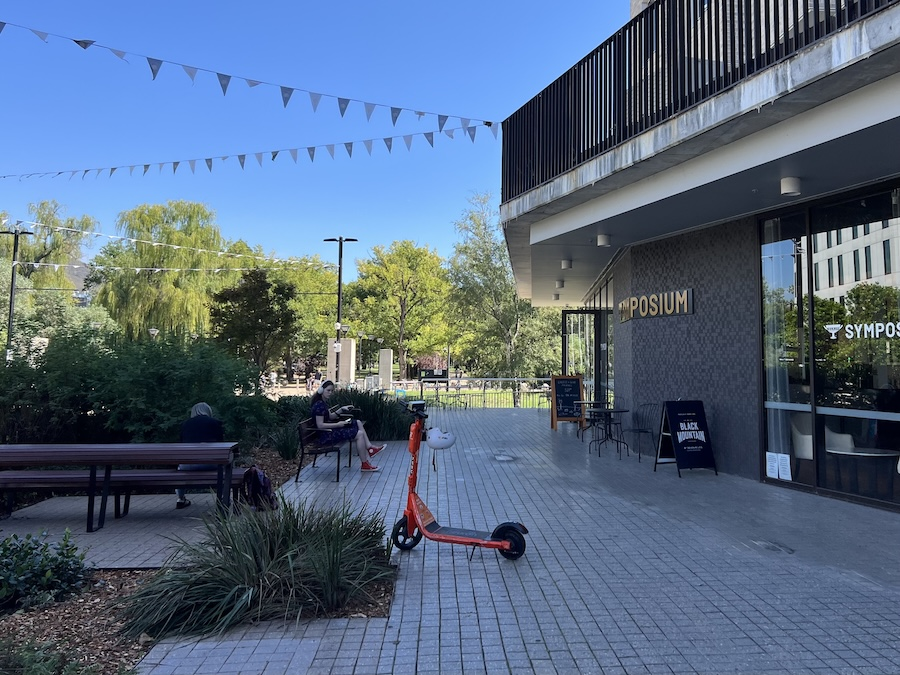

_This is a transcript of a discussion with Professor Alice Hughes, of the University of Melbourne, on 19th March 2026. It has been editted for brevity and clarity - mainly on the part of the interviewer - and I have also added links and references to the content we discussed._

At the Atlas of Living Australia (ALA), we see a lot of commentary that data quality should be improved. What's your view of that problem?

There's a lot of misconceptions based on what things like GBIF looked like when it first came out, which is no longer true. But the reputation prevailed. We recently got revisions back on a paper critiquing the [IUCN Red List](https://www.iucnredlist.org), and why they don't use GBIF data, and one of the reviewers literally said, "Well, it's because it's too low quality and full of errors". And so there are still people in major organisations that are pushing that narrative, which is unhelpful and untrue.

My impression from your work is that you are often doing global analyses, and sourcing the data for those analyses from GBIF. Is that right?

Well, we have downloaded ALA data. When we did the global bee data stuff, we included it. Well, we had another bee one out recently [@dorey2026estimating; @noori2026curated] and then the original one was by James Dorey [@dorey2023globally].

Okay, so you predominantly use GBIF, but sometimes ALA and other sources where relevant. And, just for context, it seemed to be that species distribution modelling and derivations of that were the main use case. Is that a fair description?

We do a whole lot of stuff. So we have another paper on this that's in review at the moment, but if we're looking at global data coverage [@hughes2021sampling], where it's not increasing? Why that might be? What are the factors behind it when some countries seem to be doing better or improving that picture than others? Basically, if we look within something like the Global Biodiversity Framework (GBF), the primary data should follow those CLEAN criteria [_MW: Complete, Legible, Error-free, Accessible, and Non-redundant[@orr2025dark]_]. But they don't, because they rely on the IUCN data, which is not CLEAN and not timely and not representative and all the rest of it. But countries are only going to start doing something differently if they know that there are other options available. And having data that is more realistic and contemporary gives them a higher resolution by which they can then do anything else.

So we use GBIF for as much as we're able to, but I think there's a whole lot more we can do with it. Something we wanted to do that we haven't quite done yet, is look for disappearances. So where do you have places that are consistently sampled, and where species drop out? We have started looking at that but we haven't finished it up yet, because you have to have develop a whole set of different criteria so that you know it's not just because sampling protocols have changed. And then over what time period, *et cetera*. But no one is really looking at where can we actually infer that species have lost habitat, especially if land cover has remained consistent and it's from another factor? 

That's a really interesting use case.

Yeah, and again, it's something that good distribution data can tell us. No one's really looking at it yet. And because we don't have good long-term data, from almost anywhere, using the data as a surrogate allows you to answer questions, you couldn't answer without types of data that are rarely collected. 

We've been looking at the GBIF documentation around the new [Darwin Core Data Package](https://www.gbif.org/new-data-model), which is an extension of Darwin Core to support more complex data structures. Is that something that might help your work?

In theory it should help you answer those questions. If people have got the data, if they share it with you and if it's consistent.

You said earlier that you felt that a lot of the critiques of GBIF were based on a previous state. Does that mean that you think it's gotten better?

It has got better, but there's still a lot of problems. The fact that you still have a bunch of points at zero-zero is a case in point [_MW: observations with no known location are often given 0 degrees latitude and longitude_], but there's a whole lot of really easy things. When you select a country, you'd think that then you'd only have points in that country; but you'll still get a smattering of observations all over the world. And you're like, hang on a minute. The fact that there are better taxonomic backbones being applied does help when they can be used, but obviously challenging from many other perspectives. 

{width=80%}

So there's still problems in the data that you're using, and you still have to clean it. What does your process for cleaning data look like?

We normally develop pipelines to help us clean up. What would be very helpful would be some more options for how to use flags. So now you have a way of flagging things, but it would be great if then you had the facility, but do you want to include the data that has the flags, or do you just not want to download them? Because especially for people in developing economies or for people anywhere who don't want to code, the problem is that you then have to download, what, 3,000,000 records? And a bunch of them aren't going to be useable because they have those flags. It's harder for them to clean. So if you then had the download facility, and could say "include with flags" or "remove with flags", just basic things like that would enhance the useability and also probably prevent confusion. 

Do you find that the data cleaning toolset that you have access to as a researcher is adequate, or do you think there's still gaps in it?

We have people in my collaborative teams that are very good at code, so we get by. In most of our big data papers, for example when we work with our collaborators from the Chinese Academy of Sciences, they can code in five languages. So we're comfortable; but a lot of people aren't in that situation.

Do you find there's still a lot of expert knowledge required? Do you have to have a human checking process in your projects, or have you got to the point where your workflows are sufficient?

We develop enough checks to know if we need to clean the data further. So in the case of the Southeast Asian bats where we're doing predictive modelling, there is a lot of cleaning of that consists of, for example, a bigeographic realm filter, and then an island filter. So we will develop a series of additional filters just to help us with the various stages of the data and that also removes a whole bunch of stuff that shouldn't be there or coordinates have been inverted or whatever.

So you need to have some basic a priori knowledge of where the species should be?

Right. In some cases, what we do, the IUCN data is problematic, but it does include a country list. And so if we don't have good knowledge of the species, we can make use that and then buffer it and have that as just, well, that's the bigeographic region because it should have been recorded there. And so sometimes our mechanisms of cleaning, we try to use that just to help us get the regions correct to make sure you're not having too much outside. There are caveats and there are groups which it won't apply to, but you do need the additional geographic filters. 

If I can just reflect on that a little: So you're effectively finding proxies for biogeographic information; and because there's no ideal description of where living things should be found, sometimes you're using more than one.

That's right. Think about if you're looking at a whole load of island endemic species. And then we sometimes will categorise species as to what zones are in, and then you iterate it. so that you might have multiple different combinations. But it helps just ensure that things aren't going in places that you know they're not.

It comes down to a question of what's known about the species, right? And this what came up for me when watching your presentation[@hughes2025livingdata] is that...You have this quite disparate information, that comes down to being just knowledge about a species. Where it is, but also how it lives. Which are encoded in really different ways.

It's really important, because they enrich the work. Smarter modelling doesn't replace people; it just means that you need to find better ways of translating their knowledge into something that factors in. And then you can validate and calibrate. So like with your people who clean it up, normally it's me that does so a series of checks and then when it's not up to standard, rather than manually cleaning it, because you're never going to catch anything. what is causing these errors? Can we find a more systematic way to remove them?

{width=80%}

Something I've been wondering about lately is whether there's merit in trying to turn our flagging system into something more probabilistic. That is, to try and understand what the evidence is supporting a given observation being where it is. Have seen work like that?

Not for distribution information, but for other forms of information. So when I went to the IPBES plenary recently, I talked to David Cooper, who's the former [Chair of the Convention on Biological Diversity](https://www.cbd.int/secretariat/former-es/cooper.shtml). And he'd skim-read our chapter for our assessment, ours is on Data, and he said that one thing we needed to cover more was uncertainty. Now, the interesting thing is, of course, to a scientist, uncertainty is important. To a politician or a policymaker, uncertainty is scary. And so finding the right nuance and the way to communicate that is a challenge and what components of uncertainty do we need to talk about in a way that is understandable?

And of course, the uncertainty of every different type of data is different. When it comes to species distribution data, the challenges are really varied. It could be _this_ occurrence is improbable because this should not be in the species range. It could be improbable based on, well, it comes from my [iNaturalist](https://www.inaturalist.org) and actually their algorithm at the moment allows you to see what other people have said a species is, and so people are gaming their metrics, there is more uncertainty that. If they changed it, you'd have much higher confidence in the data. And so, you could have a range of different matrics that contribute to the uncertainty. One might even be, this is an old record, and we know that geographically most of the old records are going to be highly imprecise. I remember trying to work out where a whole load of samples work from Myanmar[@aung2025conservation] based on the old geographic names and you're like, yeah, but this is always going to be an approximation and you don't know if that was just the nearest city and it was 100 kilometres away. 

We see a bit of that, particularly in very old records

Yeah, I know. And those things are interesting in their own way, but you just have to understand the limits of the data. In China, even when I was working there, there were certain people that would not go out with GPS, who were collecting specimens; they would just approximate it or say the nearest township. Which meant that then using the data was nightmarishly difficult because there was high uncertainty for all of it, and a lot of them were endemic species.

Was that an attempt to hide those locations for senstivity reasons?

People just didn't always think about how important it was to have by the accurate information. And then a senior colleague was like "Oh, it doesn't matter if you round up to the nearest decimal point". Yes, it does! You're looking at at least 50 or 100 kilometers. 

You mentioned in passing before that you haven't seen dealing with uncertainty in a species distribution context, but you've seen it in other contexts?

Well, not well within specious distribution data. Like, obviously, with their models and stuff, because they're probabilistic, you have it; but in the data itself, not too much. There's a whole lot of ways you could do it. The other contexts where you see it are often very different. So I also, and I alluded to it briefly at the end of my talk, do work on wildlife trade [@hinsley2024creating; @hughes2025urgent]. And a lot of that data is terrible. Because there's a whole bunch of errors that come in in how it's encoded. And the fact that we know some species will be being laundered under junior synonyms, or there's more regulations for that one than this one, or if we change the name on this shipment every year, then they won't figure out we're importing large numbers. 

There's a whole lot of problems, and that's before you get to the quantitative error, because when you're importing things, you need to specify the unit and the volume, but it's very easy to put the wrong unit. And so maybe instead of grams, you have milligrams or instead of number of individuals, you have tons. And so suddenly then "1000" has a very different interpretation. Yeah. Also, with things that are traded in ice or water, normally that is included in the weight, and so you'll see people who are doing the calculations that the average fish is 100 grams and therefore there must be X number of them but no, it doesn't work because you've included water and you don't know how much water there is. 

So, some of that is easy to get uncertainty on, and we're trying to develop measures on it. Other bits are more challenging and so, in many cases, looking at ways to try to filter out the problems is better than just saying that there is uncertainty. But I think with the species distribution data, it's either going to pertain to accuracy of identification or accuracy of placement. And so having a certainty metric would not be too challenging in that regard. You just need to have the right criteria behind it.

That's interesting, and it reflects my thinking as well. Outlying observations might be poorly geolocated, but they could have been misidentified. So they're in the right _place_ but the wrong _taxon_. And so it struck me that it would be useful to find some way to distinguish between those or put some estimate of certainty in both dimensions.

When we've been trying to clean stuff, even, again, going back to wildlife trade, something we did with that data was try to look if things were being exported from countries that they're not native to. Now, when it comes to something like arachnids or reptiles, that's really challenging because the spatial data is bad. Yeah. So we did make a global map of all their distributions. It's more than 50,000 species. It was challenging. We did do it at the country or province level in the case of places like the US. And then cross-link where it said it was being exported from, from the places it was native. And normally were them buffer around us. 

So, in terms of buffering spatially, you could either do it by, we normally just do like the adjacent countries to the ones that it's recorded in. The other way you can do it, of course, is do it by biome. So, okay, it's in Brazil in Pantanal. Let's get up the Pantanal in the adjacent countries. And then you could have that as very likely habitat for that species. But then other biomes that are in the neighbouring countries might have lower probability. And that way you can combine that biotic filter with a spatial filter in terms of probability, which makes up for the lack of surveying.

Something that a lot of people do when they clean their models or trim their data is something that unsurprisingly annoys me is they'll do a model and they'll include good variables and then they'll use a minimum convex polygon to trim it. But there's a problem, which is that not all of your points are going to be at the boundaries of that species range. So you're losing any potential habitat outside of where that species was sampled. And so minimally, what you should be doing is having some form of spatial buffer, or just trimming to biome. And this is why often we will use a biome- or realm-type filter, because that way you are retaining the biogeography and you're not putting something in place that you know is truncating the range. And then you have less of a dependency on sampling density [@hughes2024big].

That's really interesting, because it wouldn't necessarily have occurred to me that the data would be sufficiently reliable on the sort of habitat that species would be in, and for that to be spatially available enough of the time, for that to be a useful filter.

For non-specialist species, it should be. For specialists it's going to be more challenging. And it depends on the area I'm looking at. Because the other problem is that if you were using a land cover filter, which would be lovely, most global land cover maps are terrible. When you overlay them with a satellite image you'll see that none of it lines up. Even regional ones, like there's [MapBiomas](https://brasil.mapbiomas.org) for South America, but you cross-reference it with the habitat and it's basically all wrong. 

But that's useful, right? Like, that's the point of this exercise. Because I want to know what's good and that means I need to look at it critically at the data and make sure it meets my needs.

Yes. Which far too many people don't do. They're like, I'm sure this is exactly what I wanted. It wasn't created for you. You were probably making assumptions about it. The person who made it didn't even think about it. So it does depend. 

But for something like a Species Distribution Model, you've already encompassed a lot of those biotic factors. So then by trimming it, that's mainly just controlling for stuff that should not be there. And this is also when we are updating, like, islands with a biogeographic filter; The model can only reflect the environmental envelope. It can't reflect those other things, so we need to have other ways of putting it in there. And that might even be, for example, there's a mountain range. I know it's not the other side. So we will make a bespoke rule that actually says if they are both sides of the mountain range or not. 

{width=80%}

Given this complexity, then, something I've been thinking about is what kind of model you could build that would even work on the occurrences themselves? I think there is scope potentially for finding things that are odd in the system, and passing that information around the model somehow. Say we found a method that could reliably identify some kinds of outliers. Are they all from the same provider? Or from different providers, but using the same method? Are they on the same taxon? Do other members of that taxon have similar issues?

Scientifically, I would prefer someone who's honest with the limits of the data to pretend it's all good. 

Yeah. So the ability to state, for example that "We don't know whether this specific point is correct or not" could have real merit. We're not saying that it's a bad record. We just _don't know_ if it's representative of its distribution. Versus a different record might be right in the middle of its distribution, but everything else from that provider is an outlier, so I probably wouldn't use this record anyway. It's interesting to think whether a model like that would be useful, or even possible.

It is interesting. If it's in the middle of its range, it's probably not a particularly useful record anyway, because you're gonna have other things that will have been recorded within the same vicinity. So it's done not providing you with any added information. 

That's a great point in that classic decision-theoretic approach. Meaning, would you change your decision based on this observation?

Probably not, no; and even in a modelling context, normally you have spatial thinning algorithms. So that record would be thinned out anyway. But then if you have a low quality provider, working out why, like, oh, well, it's iNaturalist and then you aren't filtering it properly. It might also incentivize them to do better because they don't they want to be seen to be valid. It's part of their hallmark. And so then they might say, well, actually now we do need to put in place this fix. Perhaps we're going to make the initial identification invisible, so that you have completely independent identifications. And then it will show up, but you already have to have several people independently making that suggestion. Because they don't want to no longer be seen as valuable because one reason people contribute is because it feeds you into science.

I also wonder whether you'd find different types of problem in different datasets. I mean, I've heard negative commentary about citizen science datasets, but old muesum records are often really hard to gelolocate, for example.

Yeah. You look at the specimen labels, and you'll realise how imprecise it is, or even the number of things that get described from a museum drawer that have been sitting there for a 100 years. Like, just the answer is uncertain.

I do wonder sometimes whether we actually have a shared understanding of what databases like GBIF should try to accomplish. In an ideal world, they'd be a snapshot of what is known about biodiversity, or biogeography, at a given point in time. And I don't think they're acting as that, both because people have information external to the system, and because some of the data in the system is wrong.

No, they're not acting as that. And it's interesting to think about whether they could function better and under what circumstances. If countries regarded them as that, and they saw the value add, and so having worked across Southeast Asia for significant portion of my life, because many species have ranges that transcend multiple countries, given that the data within GBIF is fragmented, because most national park authorities and governments hang on to the data, you cannot accurately map most species ranges. And that means even when it comes to any form of management or conservation intervention, you're limited in your capacity because you have partial data. And so, If countries cared enough about the species, they would actually not hang on to the data because they'd realise that by sharing it, they could actually have better data that would help them make decisions. And they don't value biodiversity enough at the moment. 

Now, I don't think it is likely there will ever come a point that these databases provide us with the perfect information in part because parts of the biosphere are always going to be sampled at some form of resolution that doesn't live up to it. Like the deep sea, even if you start having better data, you're not going to have temporally sufficient data for our needs. But what we could have is much more _representative_ data, at least for terrestrial systems, and a higher portion of the data that feeds into systems where it is useable, because at the moment you have an iceberg where this bit is visible and then you've got that bit that is visible but not useable, and then you've got everything else, which you're just like, I don't know how much there is, or where it is, or what state it's in [@orr2025dark]. 

I find this a lot. Sometimes when I'm at a conference someone will point at the records for a species on ALA and say "Isn't that crazy", and I won't know what they mean. And it will emerge as we speak that they have an amazing knowledge of this species, but it's not recorded in the ALA or perhaps anywhere else. So the critiques of data that we find are often based on information we don't have.

I get that. That's frustrating. But it's slightly odd to think...the scale at which we just are lacking so much information. I'll do cave biology, for example: 90% of cave invertebrates in both Australia and China are undescribed. You don't even know the species, and then you don't know much else. Also no baselines. We went to one cave in Indonesia and it had such high densities and it just struck me that our baseline for these systems is completely wrong because it's based on basically already highly perturbed caves. And the thing is, where the cave system is the microclimate is massively important. Changes in agriculture are going to change the water table and that is going to change the microclimate. And so our ability to detect change is impaired by the fact that not only a baseline shifted in places we can see, the baseline has actually shifted in places we can't see because we've already had profound effects on it. So we can't develop a sense of baseline. 

Yeah, it does make me wonder. I was thinking about how you can walk through an Australian forest in the middle of the day, and everything will be silent because it's too hot. And actually, even in peak periods, there's not _that_ much stuff in it. Now maybe there's a lesson there that not everything has to be high density to be valuable; but some of it's a shifting baseline syndrome where things got wiped out of there and you can't see them anymore. And understanding which of those is the real phenomenon is tricky, or whether they're both true.

Yeah. I like the, also going back to caves, the reverse situation. Taking students into a cave because they'll go in and I think it's a dead empty space. And you're like, turn out the lights and listen and their eyes adjust and their ears adjust and suddenly they hear everything around them. And some of them, it will have quite a profound impact because they've gone in thinking one thing - a dead empty space - and then come out and realising just how much life there is. And it's very interesting just to watch that recognition in people. That does sound a little weird.

No it's true! It's been a while since I've taught at a university, but we did the same thing with spotlighting.

I love the night. It's so nice. So much is out and you just people don't appreciate that the natural world still comes out at night in part because we're not around to see as much. And it's beautiful in Australia. And when the moon is bright enough that you cast a shadow and...

That's actually something I miss sometimes about doing frog field work.

It can be isolating, but it can be really free. I went to boarding school from the age of eight, and I remember when I got back to my family's farm, and just want to go for a walk, even when I was maybe like 12 years old, and just walking around the fields and seeing that shadow, and the only sound really being natural sounds, and there's something quite magical about that serenity that you can forget about what humans have done and just enjoy the sounds of the world around you at night. 