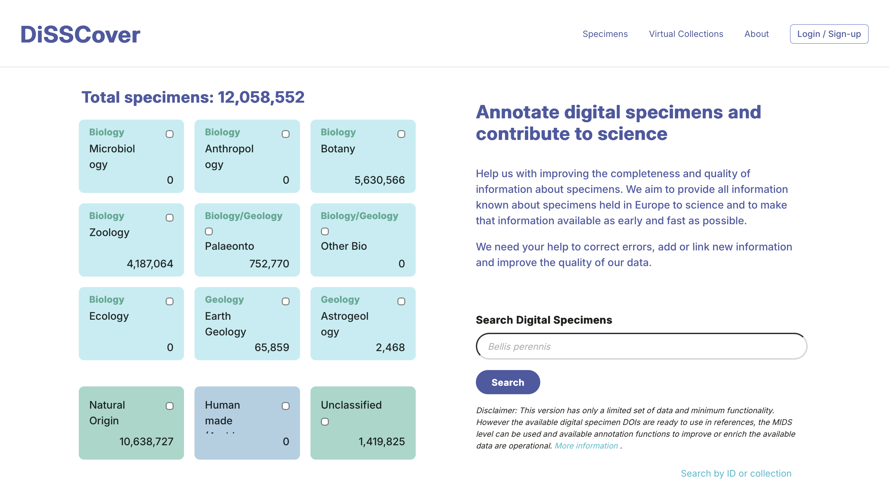
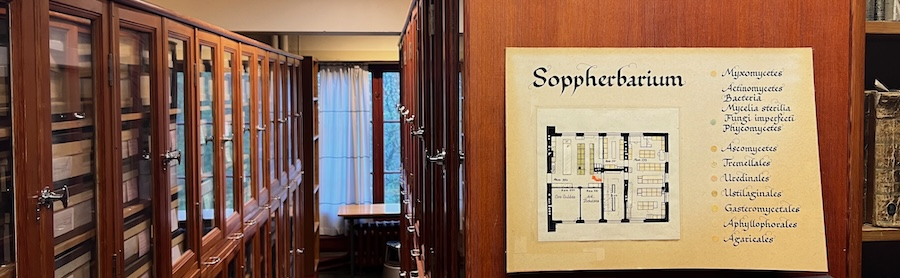
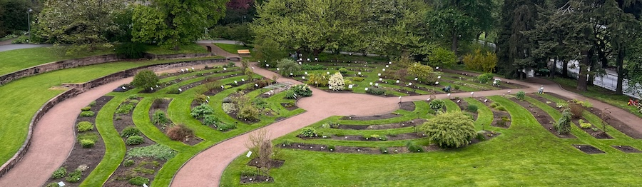

_This is a modified transcript of a discussion on 13th May 2026 with Dag Endresen & Fatima Parker-Allie, node managers for GBIF Norway and GBIF South Africa (respectively). The transcript has been edited for brevity and clarity - mainly on the part of the interviewer - and I have also added links and references to the content we discussed._

**Martin** Perhaps we could start by talking about the organisations you lead. We had the GBIF Norway node meeting earlier, Dag, and there were more people than I expected; how big are your respective nodes?

**Fatima:** The GBIF Norway Node has a big staff complement.  The  node has a network structure that includes a number of organisations. This is an excellent model, in my opinion, because you are including the broader network of stakeholders immediately into the Node, and you also get buy-in and a sense of ownership from institutions through this mechanism. 

**Dag:** As Fatima says, we have [node staff](https://www.gbif.no/about/node-staff/) across the country; we tried to spread out to cover more of the country. And the [node board](https://www.gbif.no/about/node-board/) has one representative from each organisation.

**Martin** And is that the same with your node, Fatima? 

**Fatima:** Currently, we are constrained with capacity, especially in the data management arena. The Node does not have an expanded governance structure, and neither does it have additional dedicated node staff. We do, however, work through a collaboration model to support new areas of data mobilisation and scientific research. These include advancing scientific endeavours through supporting Postdoctoral fellows and advancing mobilisation of new data types like eDNA.

Recruitment of qualified staff with the relevant skills to manage and use biodiversity data has been a challenge, however. Students are not coming out of the university fully equipped, to support the data-driven requirements of relevant data intensive institutions. We’ve been looking at curriculum development in biodiversity informatics at a national and international level to address this gap. We don’t really have enough critical mass of people who can deal with biodiversity data in the country. 

<figure class="figure">
  
  <figcaption>Botanical Museum, Lids House, Oslo Botanical Garden, May 2026</figcaption>
</figure>

**Martin:** Do you get asked questions about data quality in your roles? 

**Dag:** Yes. 

**Martin** Do you see that as part of your role, as part of your advocacy as part of GBIF?

**Fatima:** Definitely.

**Dag:** Data quality is extremely important.

**Martin:** I find that some people view it as the data providers problem, some people see it as a GBIF problem, and we're sort of in the middle.

**Dag:** That's definitely the way the mechanism in GBIF has been, that you notify the data owner. So GBIF has been very cautious to modify the data.

**Martin:** Which I think is fair, right?

**Dag:** I think we need to be braver. So, we have been detecting and flagging errors and issues in the GBIF portal. And there are some ways where we enrich the data published to the GBIF portal with geography and so on, so that you can browse facetted search, which is fine. But there's always been a discussion about annotations, so that you can actually provide data _improvements_. Some datasets are dead: institutions are gone, projects are finished, people are dead. So there's some orphans, some data without really anybody you can ask to fix it. So we’ve been fixing some of these data sets at the GBIF node when people have been pointing out mistakes. I don’t know if anybody has given us permission for that. But when people are dead, you can’t really ask them.

I think that we need to be much more bold, and I think we should start to use annotation systems. In DiSSCo [The [Distributed System of Scientific Collections](https://www.dissco.eu)], we have this machine annotation system. It's still a sandbox, I don't know if you've seen it?

<figure class="figure">
  
  <figcaption>Screenshot of https://sandbox.dissco.tech, 15-05-2026</figcaption>
</figure>

**Martin:** I haven't, no.

**Dag:** We’ve also been building an AI LLM system that can make machine annotations. Overall, the DiSSCo annotation system allows anybody, also humans, to make annotations todescribe, correct, and improve, specimen data. Anybody can go in and actually annotate, and improve the specimen records. I share completely the opinion of DiSSCo that GIBF needs to relate to such annotations and somehow try to merge these as another data source into the collection data presented in the GBIF portal.

**Martin:** I've seen systems like this before. Our National Library has a similar system to this, where they digitise things and volunteers can go through it and say "You've transcribed this wrong" and correct it in real time [[trove.nla.gov.au](https://trove.nla.gov.au)]. What's the AI component to it, though?

**Dag:** In a recent GBIF CESP [Capacity Enhancement Support Programme] project, we tested to connect a robot to digital specimens with images of the digital specimen, and set the AI to transcribe the information off the label, and to transform that data to Darwin Core. And then the robot can link the annotation to the source data and create machine annotations about the specimen record.

**Martin:** I've seen as well that GBIF have released a [test system](https://data-blog.gbif.org/post/2026-01-21-rule-based-annotations/) for allowing people to create their own rules sets. Have you seen that?

**Dag:** Rules set for what?

**Martin:** So you'd be able to create custom filters that include a fact about nature. So the example they gave was that there shouldn't be any penguins in Norway. And you can apply that rule to your downloads from now on, and you can share your rules, and other people can use them if they want.

**Dag:** The problem with many of these systems is that they require round-tripping; that you need to get the data publisher to correct the records for it to be corrected on GBIF. I think we need to be a bit bolder and accept that there are different sources of truth that we should expose. So there could be different, alternative truths. Right now there’s one ground truth: It’s the data source, the data owner. I also think we should also accommodate and credit the people that do work to fix data records. GBIF are doing lots of interesting stuff, but I think we should incorporate something more machine-driven. Another problem with round-tripping is that the data providers don’t have the resources to fix all the data.

**Fatima:** To support a national data publishing process, at the South African Node, we ensure that we have a structured verification mechanism with the data provider. We assess the data before the publishing process, and then advise the data provider of any recommended changes to improve the quality of the data.  We then require a sign off and approval from them, before uploading an updated dataset into the information system or the [IPT](https://www.gbif.org/ipt).

Although, as much as we want the best quality data within the system, those data providers are often constrained by time.

The issue for the National nodes is that we are facilitators of the data, for publishing purposes, and are not necessarily authorised to make changes to the data itself, as we are not the owners of the datasets.  Therefore, we have made a decision that we will  highlight what needs to be fixed and improved,  but we still need them to agree before we publish that. Otherwise, we’re not publishing what  was shared with us by the data owners.

**Dag:** Yes, but you can publish what they give, and give annotations on top of that. So you don’t change what they say; you add what other people are saying about their data.

<figure class="figure">
  
  <figcaption>Botanical Museum, Lids House, Oslo Botanical Garden, May 2026</figcaption>
</figure>

**Martin:** My thinking here was, is there something we can do that would be better at detecting things that are obviously wrong? And so the framework that I’m looking into here is: Is it possible to build something mathematical or statistical, that would estimate the amount of confidence that we think you should place in this record? So that was the origin of this whole project, which was to start thinking about whether that problem was remotely solvable.

**Dag:** But if we can say "We think there's a 95% chance that the place is here", can't we just give them the place that we think it is? That way they don't need to _discard_ the record, they can get the _correct_ record. While they also can be given clear information that this is not what the data owners sent. This is what this person said to improve your record. And then when you cite it, and so on, you should credit all the contributors, including the annotators.

**Fatima:** But there is some quality flagging in the data.

**Dag:** Exactly, and that's for discarding records, not for getting the improved record. So you have to improve it yourself. But you could take the improvement other people made and trust it. 

**Martin::** And that's the benefit, I think, of a human approach, because anything I come up with here would generate an assertion that would perhaps, give you a score; and then someone could choose the threshold they're happy with, right? They might say "I only want data that's over 90% certain", or over 80%, or I want it all.

**Dag:** Yeah, but what I want is the _corrected_ records. "

**Martin:** So that's why that's why you need a person, right?

**Dag:** No, you need a robot. That’s what we’re trying to do with the new machine annotation system. And when we can have confidence in the annotation,the robots could improve the records. They can read the labels, they can do things, and say that here the human who transcribed this back in the days have probably made a mistake.

**Martin:** Okay, so that makes a lot of sense to me for data from a scientific collection, where there is a real specimen to refer back to. But for a citizen scientist, for example, we may not have that evidence.

**Dag:** Citizen science also, if they report the place wrong, if the species name is wrong even after verification...If the robot says that this is most likely wrong, why not give people the option to trust the robot and get the correct species identification?

**Martin:** And so the question I'm getting at is how close are we, or perhaps how far are we, from having that robot? How would you build that model? Or does it exist now already and I haven't seen it?

**Dag:** There’s lots of image analytic robots that can be set to provide species names, which are in many cases, or rather, in some cases even better than experts in the collections.

**Martin:** And that's an interesting thing, isn't it? Effectively, I'm trying to solve a problem that is a different one from what we're getting now, because the new generation of tools are using that for camera traps and for images on iNaturalist. Or for eDNA, there's a probability already in the data that says we're X percent confident that Y observation is Z taxon given our reference library. So, I guess I'm trying to calculate that probability for a set of data before that existed, but working out how this will change is also part of the problem. 

**Dag:** But it sounds like you stop by just flagging them, not changing the records.

**Martin:** I want to know whether that's possible in general to get that score. And until I know that, I don't know whether it's sensible to say anything about changing it. But it sounds like you feel like we might be close to having that tool set?

**Dag:** I think that the round-tripping doesn't work. Data providers lack the time - the capacity - to fix the errors.

**Fatima:** Round tripping is important, although capacity remains a challenge...

**Dag:** So if we are to address these scores, we need to do something braver than just say this is the fault of the data publisher.

**Martin:** So how do you build a robot that tells you that something's wrong?

**Dag:** I want the robot to not only tell you that something is wrong, but what is the right value. How to fix the records; use all the data we have like training data for finding the likely true value, and tell us what the truth could be.

**Martin:** That's interesting, because it's somewhat more than what some of the current assertions are trying to do, right? A system like the one I'd considered is statistical that treats your points as uncertain in some ways, but it wouldn't say you flipped your latitude and longitude, for example, which we see a lot. It's just not the sort of thing that a statistical model would seek to identify, I don't think. And so in some ways, it's less useful than what we have now for that. But it might show you things you wouldn't detect otherwise. 

**Dag:** So if it's as easy as flipping the coordinates and the confidence suddenly is improved, we should flip the coordinates. The user of the data should be aware that this option can turn on and off, and choose thresholds for how much data fixing they will accept, and maybe filter out some data "fixing" that they don't want to trust.

**Martin:** So you could have something that's less 'truly' statistical in the sense that the data was treated as fixed, and that you could have some sort of iterator like that that says, well, look for unlikely things across columns, and improve your model that way. I hadn't thought of it, but that's a really good idea.

**Dag:** When we had the [GBIF CESP SpLAT project](https://www.gbif.no/news/2025/dissco-mas-splat.html) together with DiSSCo, we treated it more like we want to have the AI look at all of the digitised records and suggest improvements. We just spin through photographs, digitised specimens, and look at the data that is known and compare it to the digitisation from the data publisher and propose fixes. And then it’s simply a case of trying to find a way to somehow include these into the data portal of GBIF.

It's similar to binomia by David Shorthouse [[bionomia.net](https://bionomia.net)]. In Bionomia, you look at a collection of specimens, you can look at the collector data and see if the collecting date is before the collector is born or after they died, then this is flagged in red. Then you, as a data annotator, can go in there and correct those records. You can next download frictionless data archives per institute, per collection, and then some of our staff at the collection are round-tripping this back into our collection data management system. But there are very few museums in the world who actually roundtrip this data. So then it just lives here, in Bionomia. And so we are trying to see if we can expose these data improvements also in GBIF.

But everybody is so afraid of changing the source data. We only say, here you have original, this is the GBIF Interpretation, and we’re so afraid of messing with the data from the data owner. This is what we really would like to do with this machine annotation system in GBIF, and in DiSSCo, that we could get into, for example, actually changing an annotated and improved data value. So people could get the improved data.

**Martin:** Sorry, that's actually taken much more of your time than I meant to! Thanks for taking the time to talk it through.

**Dag:** It's very valuable that you take the time to come and visit us and share your work. These are the same problems we all deal with.

<figure class="figure">
  
  <figcaption>Systematic Garden, Oslo Botanical Garden, May 2026</figcaption>
</figure>