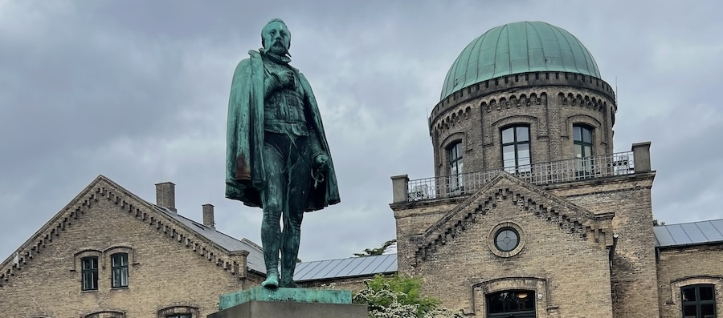

_This is a modified transcript of a discussion on 10^th^ June 2026 with Professor Serge Belongie, Director of the Pioneer Centre for Artificial Intelligence at the University of Copenhagen. The transcript has been edited for brevity and clarity - mainly on the part of the interviewer - and I have also added links and references to the content we discussed. Text added by the editor is given in [square brackets]._

#### I wondered if I could ask about the work you're doing here at the [Pioneer Centre for Artificial Intelligence](https://www.aicentre.dk). It's fairly recent development, isn't it?

It's now about 5 years old. So Tim [Robertson, GBIF Head of Informatics] and GBIF were actually a big part of why I relocated to Denmark, because I had been working on a project for years between Cornell, GBIF, and Google.

Together with Tim, we came up with this system or this concept called mediated machine vision. And we wrote a position paper on it @robertson2019training, and it was a kind of virtuous loop of human and machine interaction. Industry in the form of Google and [TensorFlow](https://www.tensorflow.org) provided the backend and easily accessible code base, documentation, and then you have all the non-profits and publishers that are pushing occurrence data to GBIF, and then you have the research team, which was called [Visipedia](https://visipedia.org), and that was Cornell and Caltech and Edinburgh and other places.

So it was kind of a neat thing where all these pieces were working together. It wasn't that the AI was out in front, it was really about the communities that were curating this data. It was building up quite a bit of momentum right until the pandemic hit, because the project had largely been driven by in-person interaction. And Google had some pretty high-profile events and they were bringing in biodiversity experts from around the world. There was literally going to be a booth that had a Nitrogen-rich log that they were going to bring in and like...I mean, it just sounds funny in retrospect...

#### But it shows a real attempt to put connection between those communities, right? And that's hard to do.

That’s right. So they were going to design this booth that felt like walking into an forest biome. But yeah, that all got cancelled and then we paused the project.

But that approach made a big impact on me, in that it was AI working for people rather than the other way around. And then as you know, the generative AI boom exploded onto the scene, and there was a quite a bit of backlash against AI in a whole bunch of different domains in terms of copyright violation and intellectual property theft, and just generally this feeling that it was becoming antagonising. And it was really validating that the way that we were approaching things with GBIF as the mediator, and the pause in the project, meant that we dodged a bullet. And then we saw other people taking those bullets.

<figure class="figure">
  
  <figcaption>Pioneer Centre for Artificial Intelligence, Copenhagen Botanical Garden, June 2026</figcaption>
</figure>

#### That's really interesting, because the iNaturalist computer vision model is remarkable to this day. I mean, I know they keep working on it, but it does have community acceptance, right?

Right. And it’s so strange. I mean, I still can’t believe how much time has passed because it’s weird, some kind of time dilation effect. We were developing computer vision methods and deep learning backbones around the same time that iNat and Merlin were developing their pre-AI apps. The Visipedia project started around 2008 and the real in-the-trenches embedding, where we had our researchers go sit at the California Academy of Sciences and at Sapsucker Woods in Ithaca, that was happening around 2012 through 2014 or so. I don’t remember which app went public first with the AI features, but it was around 2017. That’s now almost 10 years ago! It’s regarded as old-fashioned AI. More recently, in the post-ChatGPT era, the community that responded so negatively to some of the more experimental iNat initiatives involving generative AI, found itself wistful for the “good old days” of AI. You know what I mean?

#### Yeah, absolutely.

So that stuff where there was no personality to the chatbot. It was just curated data, with attribution, with provenance tracking, with trained models and DOIs. It was just a good, old-fashioned, scholarly approach.

#### It's very statistical, right?

Yeah, and there wasn’t this attempt to somehow create this sort of engaging, virtual guide experience that “enhances” the identification experience. And that part, I know it was well-intentioned when [Scott Loarie](https://scottloarie.com) and others started to do that, with the best interests of the community in mind, but as you may know, one of the founders of iNaturalist [[Ken-ichi Ueda](https://kueda.net)] was so upset with what was going on that he actually left. I don't know if he's come back, but...

#### I saw his [blog](https://kueda.net/blog/2026/01/06/why-i-left-inat/) about it. It seemed to have gone quite deep as a set of cultural problems. 

Yeah. So jumping ahead to my move to Denmark and then building up the centre, we brought that kind of cautious community engagement philosophy to everything we're doing. Biodiversity was an inspiration in terms of how the [TDWG](https://www.tdwg.org) community and GBIF and all the publishers interact with each other. For example, when we work on preventing the spread of misinformation on social media, there are lots of analogies that we carry over. So it's had quite a bit of impact. I should acknowledge that I'm not a biodiversity researcher myself, but I've worked with that community now for like 15 years, and I feel I’ve picked up many valuable insights during that time.

#### That's so interesting, especially your points about the machine learning era. My background is in biodiversity science, so I wasn't especially close to it, but my recollection is that at that time, people were talking about the challenge with machine learning models being that you need quality data and you need people checking it. Do you feel that's still an important issue in the modern day? Or do you think that's going to be whisked away by this next generation of AI?

I think there are some important divisions among general purpose consumer facing apps. Like if you look on the App Store, fortunately, iNat and Merlin are still ranked at the top, but there are many, many semi-shady alternative commercial offerings. It’s not clear where those apps got their data exactly, or whether there’s any QA whatsoever. But the biodiversity community defends the good apps [iNat and Merlin] so ardently that I’m sort of reassured, but there is, um…how do I put this?

When you have a casual user that just wants to know about plants in their garden, that's sort of a drive-by use of the app and they may never look at it again. Or it could just be like once a year driven not by biodiversity interest, but something else. And in those cases, I don't even think they're pondering all of these deep issues about data; adversarial attacks and data quality and stuff. It just it's so far from what they're thinking about. 

But then you've got the scholarly community who have a general interest in biodiversity and then targeted interests for mycology, or let's say that they're consulting for municipalities that are dealing with property that's being built in various parts of the country and they need to know about the species that are there. So there are people who really need to know the details, and _they_ are going to ask these deep questions about data provenance and so on. So I think there's a divide there. 

One of the ways that we stumbled onto this sort of a culture clash, but again, before all the vitriol started. This was like a good old fashioned collision. 

When we were working with the Merlin team, I was still at Cornell at the time, so it was really just a matter of crossing the campus, but we had just written a paper together with Google collaborators that was essentially showing off just how many errors could be in the label training data and then still get really good performance on the recognition @van2015building. So it was something that we trumpeted and that we knew from some empirical studies, a rough idea of how many mislabelled instances we can tolerate, at the overall species level as well as in terms of parts and attributes of the birds. And from a machine learning perspective, this was really cool. And I noticed during one of our project meetings, however, that they did not feel comfortable with this at all. And I thought, wait, what’s going on here?

And they said so many of their users open the app and actually just go to the gallery and they flip through it and in the gallery for each of the birds, you can tap on it. There's a type specimen and then there would just be galleries of examples. And they said, "So what you're telling us is if they do that, they're actually going to see some incorrect examples." And I said, "Yeah, but we're robust to it." And they're like, "No, no, that's not how this works!" 

So I asked them to explain this to me. They said users go to the gallery. They tap on it. There are going to be incorrect examples. So then why don't you fix those examples? Right? And I realised, wow, this is interesting because I didn't realise people would just sit there and look at those images; to us this was just training data. And they were like, look, people love birds! They're just going to sit there and they're going to look at these. If they see something that's labelled incorrectly, and write to us and we tell them, "Don't you worry, the system is robust to that." They'll say, "Okay, then fix this", right?

<figure class="figure">
  
  <figcaption>Pioneer Centre for Artificial Intelligence, Copenhagen Botanical Garden, June 2026</figcaption>
</figure>

#### You're spot on. I remember speaking to someone who was doing some work on data quality, and their view was that the work was valuable and interesting, but they were also a bit baffled, because the frequency of severe errors that we were detecting was only about 1%. But to an expert, those errors are so fundamental that it adds a worry that all the data might be compromised in some way. So suddenly you have to check everything because you've seen one thing that's wrong. There's a bit of a clash of cultures there, isn't there? 

Yeah, the one community considers it bragging rights and the other sees it as an Achilles heel. 

#### The converse is that when I speak to researchers in the field and say, look, you use GBIF data every day. To what extent are the tools you have now for cleaning that data adequate? Or do you find you're systematically having to spend large amounts of time generating new tools or checking things manually? And they usually say, no, generally it's okay; it doesn't affect our models much, or if it does, we can spot it. And so it's sort of this weird meta problem in that you've got, it's sort of there and not there depending on who you are.

One bigger picture around that is - and the generative AI boom has exacerbated this problem - that the idea of quantifying uncertainty has sort of vanished. 

In the old statistical tradition, you would return error bars or some notion of uncertainty. And I think when LLMs became popular, there was so much anthropomorphization and excitement about it seeming human-like that people, even prominent scientists, got kind of dazzled and stopped characterising uncertainty, mainly because it's hard in the context of these very large models. The only off-the-shelf ways to do it would be to run it with slightly different noise settings 100 times, and quantify uncertainty with an ensemble method. And that, given how environmentally wasteful these methods are, that would be crazy.

So people just accept...I mean, it's very wishful thinking, but somehow you tell the public, you put the little notice at the bottom of the chatbot to say it can be wrong. It can hallucinate. But that's like telling people don't put a Q-tip in your ear, right? They put that warning on the package and, well, you know what’s going to happen.

I think, at some point, the researchers who focussed on uncertainty and Bayesian methods and so on will have their day. Somehow it's going to come back. But they seem like scolds right now because they're standing in the background saying, "Don't trust this thing!" And yet from day to day, people are like, well, it's fine. It's like my therapist, it's my assistant, whatever. So people have to kind of titrate with this or get accustomed to that error level.

#### It's tricky as well in a world where...I mean, you mentioned iNaturalist and Merlin, but we've got people routinely using machine learning to classifying camera trap images at scale now. So we're getting new data feeds from camera traps, eDNA, and audio recorders. I think it's still potentially valuable to quantify the amount of evidence we have for a given observation. But what you _don't_ want is a tool that's aligned to a collection-based approach and which won't help you with these new data feeds. It's tricky to understand how to make progress when the world is changing this fast. 

Yeah, I think you're very right that as the architectures and the models change, any particular uncertainty characterisation method will become obsolete within a quarter, but we somehow have to keep the culture alive. 

One of the ways of doing that would be…You know how there are communities that maintain lists of endangered species? It would be interesting to keep a similar database. I don’t know what you would call it, but it would be a dataset to keep people honest. So it would be a very carefully updated set of examples that are tuned to embarrass the latest models. It would have to be updated, several times a year. But you would just have all these people that are on the lookout for these border cases.

And somebody would maintain that thing, and every time some community either starts to get a big head, or that if there’s, let’s say, passive spectrogram based kind of camera trap, an audio trap system actually gets huge deployment. Then someone needs to step in independently and say, let’s just, “If you didn’t already do the academic work to check the uncertainty, here are a bunch of stimuli to check.” Like the horror files, the worst cases. Because the advertised results are always going to be padded with all of the easy bread-and-butter type examples.

<figure class="figure">
  
  <figcaption>View over Copenhagen from the Pioneer Centre for Artificial Intelligence, Copenhagen Botanical Garden, June 2026</figcaption>
</figure>

#### That's something that comes up in this space, which is that birds are the easy problem, right? There's a huge community you can talk to, there's a huge amount of data, they're generating data in all sorts of different ways, you can test them against each other. 

#### The challenge is...I was at a conference and someone was saying, "We did bee surveys down this spine of mountains, and there was one bee that was only known from Queensland. It's actually on all the hilltops. But they're hard to get to and they're remote and no one's gone looking for bees there before" So there's this huge amount of diversity that's rare and poorly studied, and you end up with a segmented problem where for birds we can apply a suite of methods, while for the rest of the biological world we can only apply one or none. And makes our job a little tricky.

I think, talking about classic versus modern approaches, a bunch of Visipedia collaborators and I wrote a survey article circa 2021 @Van_Horn_2021_CVPR, and then we just wrote another one 2026 @ICLR2026_4a0a8ab1. So the one from 2021 is what would now be called tailored or bespoke models – the “old fashioned” approaches I mentioned earlier. Every single one was some kind of vision transformer, ResNet, some kind of backbone that’s not like a GPT thing, but just trained for specific tasks. And, circa 2026, these tailored methods are still the top performers, but they’re not as visible because they are narrow in scope. So those types of approaches are plug-in methods that work for problems that are fine grained and long tailed. So, the fine grained categories and the, you know, the rare bee species and so on, they’re in the long tail.

Today, most approaches make use of large vision _and_ language models. And even the audio signals become an image via conversion to a spectrogram. So it’s essentially LVLMs. And they’re not performing as well as the targeted models, but the cool kids don’t use the old fashioned models anymore. You have to use something you can chat with. And those models are, unsurprisingly, mainly concerned with the head of the curve, not the long tails.

If you’re using AI for science, however, you’re actually trying to discover new things. So contrary to that, the LVLMs are really front loaded with all the stuff that you see all the time. So it’s like pulling teeth to get it say something meaningful about unexpected instances. There are these papers called “eyes wide shut” @tong2024eyes and “LLM blindness” and so on, where you just, you can actually turn off the pixels, and it is so confident that it’s seeing something that’s not there. Even with my own students, it’s hard, you know, to get them to take another look at the tailored methods, since they look like old news. So we now, as a field, have this task to somehow get these new LVLMs to pull up the performance so they’re actually paying attention to what’s in the image to try to match the performance of the old techniques. It’s an odd state to be in.

#### You'd have thought in a previous generation of scholars that the performance benchmark was everything, right? And that that would have been enough for it to be persistent in the literature, but it is encouraging that that generation of machine learning models that people worked so hard on for so long are still performant at that task. Because it is hard to know from the outside, as a lay person to the world of our AI and ML, where the performance gains have been, especially as the conversational problem is not one we were trying to solve.

And I think to the lay user, because the LVLMs perform so well for the extremely well represented in-distribution stuff, it’s hard to grasp this problem. If you’re outside a research lab, you would just say, “Why do you need that old stuff? Just grab Kimi K 2.5 or something like that and get to work.” It’s like, no, I know why you think that because you’re seeing it for all of these random benchmarks, but to the biodiversity community, or anyone working with long-tailed, fine-grained phenomena, it’s a gimmick, and it’s _worse_ than a gimmick, because when it’s wrong, it’s so _confident_.