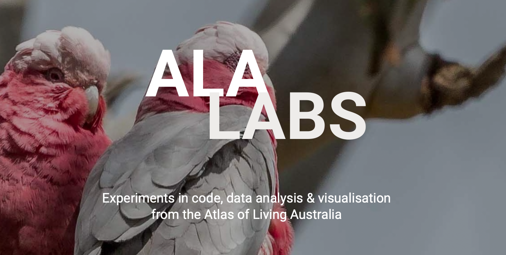

class: ALA-title-slide animated fadeIn


<br>
.main-title[<br><br><br>Mapping Australia’s biodiversity]<br>
.main-subtitle[using R & the ALA]<br>
<br>
.white[
  <b>Martin Westgate</b><br>
  Team Leader | Science & Decision Support | ALA<br>
  <br>
  NUMBATs seminar | Monash University | 2021-11-12
]
<br>


<br>
.small[The ALA is made possible by contributions from its many partners. It receives support through the Australian Government through the National Collaborative Research Infrastructure Strategy (NCRIS) and is hosted by CSIRO.]

---
class: ALA-standard-slide animated fadeIn
layout: true
background-image: url(img/ALA_Logo_Inline_RGB.png)
background-position: 90% 100%
background-size: 20%
---
.slide-title[Outline<br><br>]

.slide-title[Identity] .slide-subtitle[&nbsp;&nbsp;who we are]<br><br>
.slide-title[Past] .slide-subtitle[&nbsp;&nbsp;`ALA4R` & why we rebuilt it]<br><br>
.slide-title[Present] .slide-subtitle[&nbsp;&nbsp;`galah` & why it's good]<br><br>
.slide-title[Future] .slide-subtitle[&nbsp;&nbsp;R @ ALA]

---
class: ALA-title-slide animated fadeIn
layout: false
.divider-text[<br><br><br>Identity]
<br>
.white[who we are]
---
class: ALA-standard-slide animated fadeIn
layout: true
background-image: url(img/ALA_Logo_Inline_RGB.png)
background-position: 90% 100%
background-size: 20%
---

.slide-title[Identity]&nbsp;&nbsp;.slide-subtitle[who we are]

```{r, echo=FALSE, results="hide"}
## Number of records
# ala_counts()
## Calculate current number of providers in ALA:
# n_providers <- ala_counts(group_by = "dataResourceName", limit = NULL)
## dataProviderUid n = 50
# nrow(n_providers) # 816
```
<br><br><br>
.slide-title[Database] .slide-subtitle[&nbsp;&nbsp;101,466,364 biodiversity observations]<br><br>
.slide-title[Network] .slide-subtitle[&nbsp;&nbsp; 816 data providers]<br><br>
.slide-title[Code] .slide-subtitle[&nbsp;&nbsp; 221 GitHub repositories]<br><br>
.slide-title[People] .slide-subtitle[&nbsp;&nbsp; 34 staff]<br><br>

---

.slide-title[Identity]&nbsp;&nbsp;.slide-subtitle[time]
```{r, echo=FALSE, fig.height=7, fig.width=13}
# library(galah)
library(ggplot2)
library(viridis)
library(scales)

# get data
df <- ala_counts(group_by = "decade")
df$label <- factor(
  seq_len(nrow(df)),
  levels = seq_len(nrow(df)),
  labels = paste0(seq(1850, 2020, 10), "s"))
  
# plot
ggplot(df, aes(x = label, y = count, fill = as.numeric(label))) +
  geom_bar(stat = "identity") +
  geom_text(aes(x = label, label = label), 
    y = 1, angle = 90, color = "white", size = 6) +
  labs(x = "", y = "Number of new records") +
  scale_y_log10(
    breaks = trans_breaks("log10", function(x) 10^x),
    labels = trans_format("log10", math_format(10^.x))) +
  scale_fill_viridis(direction = -1, option = "magma", begin = 0.1, end = 0.9) +
  theme_bw() +
  theme(
    legend.position = "none",
    panel.border = element_blank(),
    panel.grid.major.x = element_blank(),
    panel.grid.minor.x = element_blank(),
    axis.text.x = element_blank(),
    axis.ticks.x = element_blank(),
    axis.title.x = element_blank(),
    axis.text.y = element_text(size = 16),
    axis.title.y = element_text(size = 16)
  )
  
```

---
.slide-title[Identity]&nbsp;&nbsp;.slide-subtitle[space]

```{r, echo=FALSE, fig.height=7, fig.width=15}
library(sf)
aus_grid <- readRDS("./data/aus_grid.rds")
breaks <- 10^c(2:7)
labels <- c("100", "1k", "10k", "100k", "1M", "10M")
# plot
ggplot(aus_grid, aes(fill = n)) +
  geom_sf(color = NA) +
  labs(fill = "Number of\nrecords\n") +
  scale_fill_viridis(
    trans = "log10",
    breaks = breaks,
    labels = labels,
    limits = c(10^2, 10^7),
    direction = -1, 
    option = "magma", 
    begin = 0.1, 
    end = 0.9) +
  theme_void() +
  theme(
    legend.title = element_text(size = 16),
    legend.text = element_text(size = 16),
    legend.key.height = unit(0.12, "npc")
  ) 

```

---

.slide-title[Identity]&nbsp;&nbsp;.slide-subtitle[taxonomy]

```{r, echo=FALSE, fig.height=7, fig.width=13}
df <- ala_counts(group_by = "kingdom")
df <- df[order(df$count, decreasing = FALSE),]
df$kingdom <- factor(
  seq_len(nrow(df)),
  levels = seq_len(nrow(df)),
  labels = df$kingdom)

ggplot(df, aes(x = kingdom, y = count, fill = as.numeric(kingdom))) +
  geom_bar(stat = "identity") +
  geom_text(aes(x = kingdom, label = kingdom), 
    y = 0.2, hjust = 0, color = "white", size = 6) +
  coord_flip() +
  labs(x = "", y = "Number of records") +
  scale_y_log10(
    breaks = trans_breaks("log10", function(x) 10^x),
    labels = trans_format("log10", math_format(10^.x))) +
  scale_fill_viridis(direction = -1, option = "magma", begin = 0.1, end = 0.9) +
  theme_bw() +
  theme(
    legend.position = "none",
    panel.border = element_blank(),
    panel.grid.major.y = element_blank(),
    panel.grid.minor.y = element_blank(),
    axis.text.y = element_blank(),
    axis.ticks.y = element_blank(),
    axis.title.y = element_blank(),
    axis.text.x = element_text(size = 16),
    axis.title.x = element_text(size = 16)
  )
```

---

.slide-title[Identity]&nbsp;&nbsp;.slide-subtitle[applications]

```{r, echo=FALSE, fig.height=7, fig.width=13}
topic_frequencies <- read.csv("./data/topic_keywords_k10.csv")
topic_frequencies <- topic_frequencies[order(topic_frequencies$n, decreasing = FALSE),]
topic_frequencies$label <- factor(
  seq_len(10),
  levels = seq_len(10),
  labels = topic_frequencies$label)

ggplot(topic_frequencies, aes(x = label, y = n, fill = n)) +
  geom_bar(stat = "identity") +
  geom_text(aes(label = prob, y = n + 10, color = n),
    size = 6, hjust = 0) +
  geom_text(aes(x = label, label = label), 
    y = 10, hjust = 0, color = "white", size = 6) +
  coord_flip() +
  labs(x = "Topic description", y = "Number of articles") +
  scale_fill_viridis(direction = -1, option = "magma", begin = 0.1, end = 0.9) +
  scale_color_viridis(direction = -1, option = "magma", begin = 0.1, end = 0.9) +
  ylim(c(0, 800)) +
  theme_bw() +
  theme(
    legend.position = "none",
    panel.border = element_blank(),
    panel.grid.major.y = element_blank(),
    panel.grid.minor.y = element_blank(),
    axis.text.y = element_blank(),
    axis.ticks.y = element_blank(),
    axis.title.y = element_blank(),
    axis.text.x = element_text(size = 16),
    axis.title.x = element_text(size = 16)
  )
```

---
class: ALA-title-slide animated fadeIn
layout: false
.divider-text[<br><br><br>Past]
<br>
.white[`ALA4R` & why we rebuilt it]
---
class: ALA-standard-slide animated fadeIn
layout: true
background-image: url(img/ALA_Logo_Inline_RGB.png)
background-position: 90% 100%
background-size: 20%
---

.slide-title[Past]&nbsp;&nbsp;.slide-subtitle[`ALA4R`]
<br>
<br>
.slide-title[Benefits]

.slide-subtitle[<b>groundbreaking:</b> released in 2014]<br><br>
.slide-subtitle[<b>flexible:</b> return the data you want, customised in various ways]<br><br>
.slide-subtitle[<b>wide-ranging:</b> any query accessible via the API can be constructed]


---

.slide-title[Past]&nbsp;&nbsp;.slide-subtitle[`ALA4R`]
<br>
<br>
.slide-title[No function naming convention]

.slide-subtitle[abbreviations: `aus()`]<br><br>
.slide-subtitle[snake case: `ala_fields()`]<br><br>
.slide-subtitle[contractions: `fieldguide()`]<br><br>
.slide-subtitle[single words: `occurrences()`, `images()`]

---

.slide-title[Past]&nbsp;&nbsp;.slide-subtitle[`ALA4R`]
<br>
<br>
.slide-title[Confusing syntax]

.slide-subtitle[unclear differences between functions:<br>
&nbsp;&nbsp;&nbsp;&nbsp;`ala_list()`, `ala_lists()`, `specieslist()`<br>
&nbsp;&nbsp;&nbsp;&nbsp;`search_layers`, `ala_fields`]
.slide-subtitle[argument names require specialist knowledge:<br>
&nbsp;&nbsp;&nbsp;&nbsp;`wkt`, `fq`, `qa`]
.slide-subtitle[arguments require `solr` queries passed as strings:<br>
&nbsp;&nbsp;&nbsp;&nbsp;`occurrences(taxon = "taxon_name:\"Alaba vibex\"")`]
  
---

.slide-title[Past]&nbsp;&nbsp;.slide-subtitle[`ALA4R`]
<br>
<br>
.slide-title[Inconsistent behaviour]

.slide-subtitle[most functions return a `data.frame` (good)]<br><br>
.slide-subtitle[`occurrences()` returns a `list`]<br><br>
.slide-subtitle[`fieldguide()` and `plot.occurrences()` output a PDF]

---

class: ALA-title-slide animated fadeIn
layout: false
.divider-text[<br><br><br>Present]
<br>
.white[`galah` and why it's good]
---
class: ALA-standard-slide animated fadeIn
layout: true
background-image: url(img/ALA_Logo_Inline_RGB.png)
background-position: 90% 100%
background-size: 20%

---

.slide-title[Present]&nbsp;&nbsp;.slide-subtitle[galah]
.pull-left[
  
]

.pull-right[
.slide-subtitle[Data]
- `ala_counts()`
- `ala_species()`
- `ala_occurrences()`
- `ala_media()`
- `ala_taxonomy()`

.slide-subtitle[Filter]
- `select_taxa()`
- `select_filters()`
- `select_locations()`
- `select_fields()`

.slide-subtitle[Lookup]
- `search_fields()`
- `find_field_values()`
- `find_profiles()`
- `find_profile_attributes()`
- `find_atlases()`
]

---

.slide-title[Present]&nbsp;&nbsp;.slide-subtitle[galah]

```{r, echo = FALSE, width = 20}
## This is original code for a multi-color slide
DiagrammeR::grViz("
digraph boxes_and_circles {

  # a 'graph' statement
  graph [overlap = true, fontsize = 15, rankdir = LR]

  # several 'node' statements
  node [shape = box,
        fontname = Helvetica,
        fixedsize = TRUE,
        width = 2.0,
        height = 0.5,
        fontcolor = '#E06E53',
        color = '#E06E53']
  ala_counts; ala_species; ala_occurrences; ala_media; ala_taxonomy

  node  [shape = box,
        fontname = Helvetica,
        fontcolor = '#c7902a'
        color = '#c7902a']
  select_taxa; select_filters; select_locations; select_fields
  
  node  [shape = box,
        fontname = Helvetica,
        fontcolor = '#7f9959',
        color = '#7f9959']
  find_profiles; find_ranks; search_fields; find_field_values; find_profile_attributes
  
  node [shape = circle,
        fixedsize = true,
        fontcolor = 'grey30',
        color = 'grey30',
        width = 0.9]
  taxa; filters; locations; group_by; fields; profile; down_to; '...'
  
  edge [ color = 'grey50' , dir = 'none']
  ala_counts->taxa
  ala_counts->filters
  ala_counts->locations
  ala_counts->group_by
  ala_species->taxa
  ala_species->filters
  ala_species->locations
  ala_media->taxa
  ala_media->filters
  ala_media->locations
  ala_media->fields
  ala_occurrences->taxa 
  ala_occurrences->filters
  ala_occurrences->locations
  ala_occurrences->fields
  ala_taxonomy->taxa
  ala_taxonomy->down_to
  taxa->select_taxa 
  filters->select_filters 
  locations->select_locations
  group_by->select_fields
  fields->select_fields
  select_filters->'...'
  select_filters->profile
  select_fields->'...'
  search_fields->find_field_values
  '...'->search_fields
  '...'->find_field_values
  profile->find_profiles->find_profile_attributes
  down_to->find_ranks 
  
}
", width = 1000, height = 500)
```

---

.slide-title[Present]&nbsp;&nbsp;.slide-subtitle[`galah::`]

<div style="margin-top:-70px; margin-left:500px;">
```{r, echo = FALSE}
## an all-grey slide - edit from here
DiagrammeR::grViz("
digraph boxes_and_circles {

  # a 'graph' statement
  graph [overlap = true, fontsize = 15, rankdir = LR]

  # several 'node' statements
  node [shape = box,
        fontname = Helvetica,
        fixedsize = TRUE,
        width = 2.0,
        height = 0.5]
  ala_counts [fontcolor = 'grey50', color = 'grey50']
  ala_species [fontcolor = 'grey50', color = 'grey50']
  ala_occurrences [fontcolor = 'grey50', color = 'grey50']
  ala_media [fontcolor = 'grey50', color = 'grey50']
  ala_taxonomy [fontcolor = 'grey50', color = 'grey50']
  select_taxa [fontcolor = 'grey50', color = 'grey50']
  select_filters [fontcolor = 'grey50', color = 'grey50']
  select_locations [fontcolor = 'grey50', color = 'grey50']
  select_fields [fontcolor = 'grey50', color = 'grey50']
  find_profiles [fontcolor = 'grey50', color = 'grey50']
  find_ranks [fontcolor = 'grey50', color = 'grey50']
  search_fields [fontcolor = 'grey50', color = 'grey50']
  find_field_values [fontcolor = 'grey50', color = 'grey50']
  find_profile_attributes [fontcolor = 'grey50', color = 'grey50']
  
  node [shape = circle, fixedsize = true, width = 0.9]
  taxa [fontcolor = 'grey50', color = 'grey50']
  filters [fontcolor = 'grey50', color = 'grey50']
  locations [fontcolor = 'grey50', color = 'grey50']
  group_by [fontcolor = 'grey50', color = 'grey50']
  fields [fontcolor = 'grey50', color = 'grey50']
  profile [fontcolor = 'grey50', color = 'grey50']
  down_to [fontcolor = 'grey50', color = 'grey50']
  '...' [fontcolor = 'grey50', color = 'grey50']
  
  edge [dir = 'none']
  ala_counts->taxa [color = 'grey50']
  ala_counts->filters [color = 'grey50']
  ala_counts->locations [color = 'grey50']
  ala_counts->group_by [color = 'grey50']
  ala_species->taxa [color = 'grey50']
  ala_species->filters [color = 'grey50']
  ala_species->locations [color = 'grey50']
  ala_media->taxa [color = 'grey50']
  ala_media->filters [color = 'grey50']
  ala_media->locations [color = 'grey50']
  ala_media->fields [color = 'grey50']
  ala_occurrences->taxa [color = 'grey50']
  ala_occurrences->filters [color = 'grey50']
  ala_occurrences->locations [color = 'grey50']
  ala_occurrences->fields [color = 'grey50']
  ala_taxonomy->taxa [color = 'grey50']
  ala_taxonomy->down_to [color = 'grey50']
  taxa->select_taxa [color = 'grey50']
  filters->select_filters [color = 'grey50']
  locations->select_locations [color = 'grey50']
  group_by->select_fields [color = 'grey50']
  fields->select_fields [color = 'grey50']
  select_filters->'...' [color = 'grey50']
  select_filters->profile [color = 'grey50']
  select_fields->'...' [color = 'grey50']
  search_fields->find_field_values [color = 'grey50']
  '...'->search_fields [color = 'grey50']
  '...'->find_field_values [color = 'grey50']
  profile->find_profiles->find_profile_attributes [color = 'grey50']
  down_to->find_ranks [color = 'grey50']
  
}
", width = 600, height = 250)
```
</div>
---

.slide-title[Present]&nbsp;&nbsp;.slide-subtitle[`galah::select_taxa`]

<div style="margin-top:-70px; margin-left:500px;">
```{r, echo = FALSE, width = 20}
# highlight select_taxa
DiagrammeR::grViz("
digraph boxes_and_circles {

  # a 'graph' statement
  graph [overlap = true, fontsize = 15, rankdir = LR]

  # several 'node' statements
  node [shape = box,
        fontname = Helvetica,
        fixedsize = TRUE,
        width = 2.0,
        height = 0.5]
  ala_counts [fontcolor = 'grey50', color = 'grey50']
  ala_species [fontcolor = 'grey50', color = 'grey50']
  ala_occurrences [fontcolor = 'grey50', color = 'grey50']
  ala_media [fontcolor = 'grey50', color = 'grey50']
  ala_taxonomy [fontcolor = 'grey50', color = 'grey50']
  select_taxa [fontcolor = '#E06E53', color = '#E06E53']
  select_filters [fontcolor = 'grey50', color = 'grey50']
  select_locations [fontcolor = 'grey50', color = 'grey50']
  select_fields [fontcolor = 'grey50', color = 'grey50']
  find_profiles [fontcolor = 'grey50', color = 'grey50']
  find_ranks [fontcolor = 'grey50', color = 'grey50']
  search_fields [fontcolor = 'grey50', color = 'grey50']
  find_field_values [fontcolor = 'grey50', color = 'grey50']
  find_profile_attributes [fontcolor = 'grey50', color = 'grey50']
  
  node [shape = circle, fixedsize = true, width = 0.9]
  taxa [fontcolor = 'grey50', color = 'grey50']
  filters [fontcolor = 'grey50', color = 'grey50']
  locations [fontcolor = 'grey50', color = 'grey50']
  group_by [fontcolor = 'grey50', color = 'grey50']
  fields [fontcolor = 'grey50', color = 'grey50']
  profile [fontcolor = 'grey50', color = 'grey50']
  down_to [fontcolor = 'grey50', color = 'grey50']
  '...' [fontcolor = 'grey50', color = 'grey50']
  
  edge [dir = 'none']
  ala_counts->taxa [color = 'grey50']
  ala_counts->filters [color = 'grey50']
  ala_counts->locations [color = 'grey50']
  ala_counts->group_by [color = 'grey50']
  ala_species->taxa [color = 'grey50']
  ala_species->filters [color = 'grey50']
  ala_species->locations [color = 'grey50']
  ala_media->taxa [color = 'grey50']
  ala_media->filters [color = 'grey50']
  ala_media->locations [color = 'grey50']
  ala_media->fields [color = 'grey50']
  ala_occurrences->taxa [color = 'grey50']
  ala_occurrences->filters [color = 'grey50']
  ala_occurrences->locations [color = 'grey50']
  ala_occurrences->fields [color = 'grey50']
  ala_taxonomy->taxa [color = 'grey50']
  ala_taxonomy->down_to [color = 'grey50']
  taxa->select_taxa [color = 'grey50']
  filters->select_filters [color = 'grey50']
  locations->select_locations [color = 'grey50']
  group_by->select_fields [color = 'grey50']
  fields->select_fields [color = 'grey50']
  select_filters->'...' [color = 'grey50']
  select_filters->profile [color = 'grey50']
  select_fields->'...' [color = 'grey50']
  search_fields->find_field_values [color = 'grey50']
  '...'->search_fields [color = 'grey50']
  '...'->find_field_values [color = 'grey50']
  profile->find_profiles->find_profile_attributes [color = 'grey50']
  down_to->find_ranks [color = 'grey50']
   
}
", width = 600, height = 250)
```
</div>
```{r}
select_taxa("Mammalia")
```

---

.slide-title[Present]&nbsp;&nbsp;.slide-subtitle[`galah::select_taxa`]

<div style="margin-top:-70px; margin-left:500px;">
```{r, echo = FALSE, width = 20}
# highlight ala_taxonomy & select_taxa
DiagrammeR::grViz("
digraph boxes_and_circles {

  # a 'graph' statement
  graph [overlap = true, fontsize = 15, rankdir = LR]

  # several 'node' statements
  node [shape = box,
        fontname = Helvetica,
        fixedsize = TRUE,
        width = 2.0,
        height = 0.5]
  ala_counts [fontcolor = 'grey50', color = 'grey50']
  ala_species [fontcolor = 'grey50', color = 'grey50']
  ala_occurrences [fontcolor = 'grey50', color = 'grey50']
  ala_media [fontcolor = 'grey50', color = 'grey50']
  ala_taxonomy [fontcolor = '#E06E53', color = '#E06E53']
  select_taxa [fontcolor = '#E06E53', color = '#E06E53']
  select_filters [fontcolor = 'grey50', color = 'grey50']
  select_locations [fontcolor = 'grey50', color = 'grey50']
  select_fields [fontcolor = 'grey50', color = 'grey50']
  find_profiles [fontcolor = 'grey50', color = 'grey50']
  find_ranks [fontcolor = 'grey50', color = 'grey50']
  search_fields [fontcolor = 'grey50', color = 'grey50']
  find_field_values [fontcolor = 'grey50', color = 'grey50']
  find_profile_attributes [fontcolor = 'grey50', color = 'grey50']
  
  node [shape = circle, fixedsize = true, width = 0.9]
  taxa [fontcolor = '#E06E53', color = '#E06E53']
  filters [fontcolor = 'grey50', color = 'grey50']
  locations [fontcolor = 'grey50', color = 'grey50']
  group_by [fontcolor = 'grey50', color = 'grey50']
  fields [fontcolor = 'grey50', color = 'grey50']
  profile [fontcolor = 'grey50', color = 'grey50']
  down_to [fontcolor = '#E06E53', color = '#E06E53']
  '...' [fontcolor = 'grey50', color = 'grey50']
  
  edge [dir = 'none']
  ala_counts->taxa [color = 'grey50']
  ala_counts->filters [color = 'grey50']
  ala_counts->locations [color = 'grey50']
  ala_counts->group_by [color = 'grey50']
  ala_species->taxa [color = 'grey50']
  ala_species->filters [color = 'grey50']
  ala_species->locations [color = 'grey50']
  ala_media->taxa [color = 'grey50']
  ala_media->filters [color = 'grey50']
  ala_media->locations [color = 'grey50']
  ala_media->fields [color = 'grey50']
  ala_occurrences->taxa [color = 'grey50']
  ala_occurrences->filters [color = 'grey50']
  ala_occurrences->locations [color = 'grey50']
  ala_occurrences->fields [color = 'grey50']
  ala_taxonomy->taxa [color = '#E06E53']
  ala_taxonomy->down_to [color = '#E06E53']
  taxa->select_taxa [color = '#E06E53']
  filters->select_filters [color = 'grey50']
  locations->select_locations [color = 'grey50']
  group_by->select_fields [color = 'grey50']
  fields->select_fields [color = 'grey50']
  select_filters->'...' [color = 'grey50']
  select_filters->profile [color = 'grey50']
  select_fields->'...' [color = 'grey50']
  search_fields->find_field_values [color = 'grey50']
  '...'->search_fields [color = 'grey50']
  '...'->find_field_values [color = 'grey50']
  profile->find_profiles->find_profile_attributes [color = 'grey50']
  down_to->find_ranks [color = 'grey50']
   
}
", width = 600, height = 250)
```
</div>
```{r}
family_tree <- ala_taxonomy(taxa = select_taxa("Mammalia"), down_to = "family")

data.tree::ToDataFrameTypeCol(family_tree, type = "rank")[1:5, ]
```

---

.slide-title[Present]&nbsp;&nbsp;.slide-subtitle[`galah::select_taxa`]

<div style="margin-top:-70px; margin-left:500px;">
```{r, echo = FALSE, width = 20}
## highlight ala_species & select_taxa
DiagrammeR::grViz("
digraph boxes_and_circles {

  # a 'graph' statement
  graph [overlap = true, fontsize = 15, rankdir = LR]

  # several 'node' statements
  node [shape = box,
        fontname = Helvetica,
        fixedsize = TRUE,
        width = 2.0,
        height = 0.5]
  ala_counts [fontcolor = 'grey50', color = 'grey50']
  ala_species [fontcolor = '#E06E53', color = '#E06E53']
  ala_occurrences [fontcolor = 'grey50', color = 'grey50']
  ala_media [fontcolor = 'grey50', color = 'grey50']
  ala_taxonomy [fontcolor = 'grey50', color = 'grey50']
  select_taxa [fontcolor = '#E06E53', color = '#E06E53']
  select_filters [fontcolor = 'grey50', color = 'grey50']
  select_locations [fontcolor = 'grey50', color = 'grey50']
  select_fields [fontcolor = 'grey50', color = 'grey50']
  find_profiles [fontcolor = 'grey50', color = 'grey50']
  find_ranks [fontcolor = 'grey50', color = 'grey50']
  search_fields [fontcolor = 'grey50', color = 'grey50']
  find_field_values [fontcolor = 'grey50', color = 'grey50']
  find_profile_attributes [fontcolor = 'grey50', color = 'grey50']
  
  node [shape = circle, fixedsize = true, width = 0.9]
  taxa [fontcolor = '#E06E53', color = '#E06E53']
  filters [fontcolor = 'grey50', color = 'grey50']
  locations [fontcolor = 'grey50', color = 'grey50']
  group_by [fontcolor = 'grey50', color = 'grey50']
  fields [fontcolor = 'grey50', color = 'grey50']
  profile [fontcolor = 'grey50', color = 'grey50']
  down_to [fontcolor = 'grey50', color = 'grey50']
  '...' [fontcolor = 'grey50', color = 'grey50']
  
  edge [dir = 'none']
  ala_counts->taxa [color = 'grey50']
  ala_counts->filters [color = 'grey50']
  ala_counts->locations [color = 'grey50']
  ala_counts->group_by [color = 'grey50']
  ala_species->taxa [color = '#E06E53']
  ala_species->filters [color = 'grey50']
  ala_species->locations [color = 'grey50']
  ala_media->taxa [color = 'grey50']
  ala_media->filters [color = 'grey50']
  ala_media->locations [color = 'grey50']
  ala_media->fields [color = 'grey50']
  ala_occurrences->taxa [color = 'grey50']
  ala_occurrences->filters [color = 'grey50']
  ala_occurrences->locations [color = 'grey50']
  ala_occurrences->fields [color = 'grey50']
  ala_taxonomy->taxa [color = 'grey50']
  ala_taxonomy->down_to [color = 'grey50']
  taxa->select_taxa [color = '#E06E53']
  filters->select_filters [color = 'grey50']
  locations->select_locations [color = 'grey50']
  group_by->select_fields [color = 'grey50']
  fields->select_fields [color = 'grey50']
  select_filters->'...' [color = 'grey50']
  select_filters->profile [color = 'grey50']
  select_fields->'...' [color = 'grey50']
  search_fields->find_field_values [color = 'grey50']
  '...'->search_fields [color = 'grey50']
  '...'->find_field_values [color = 'grey50']
  profile->find_profiles->find_profile_attributes [color = 'grey50']
  down_to->find_ranks [color = 'grey50']
  
}
", width = 600, height = 250)
```
</div>

```{r}
ala_species(taxa = select_taxa("Lagomorpha"))
```

---

.slide-title[Present]&nbsp;&nbsp;.slide-subtitle[`galah::select_taxa`]

<div style="margin-top:-70px; margin-left:500px;">
```{r, echo = FALSE, width = 20}
# highlight ala_counts & select_taxa
DiagrammeR::grViz("
digraph boxes_and_circles {

  # a 'graph' statement
  graph [overlap = true, fontsize = 15, rankdir = LR]

  # several 'node' statements
  node [shape = box,
        fontname = Helvetica,
        fixedsize = TRUE,
        width = 2.0,
        height = 0.5]
  ala_counts [fontcolor = '#E06E53', color = '#E06E53']
  ala_species [fontcolor = 'grey50', color = 'grey50']
  ala_occurrences [fontcolor = 'grey50', color = 'grey50']
  ala_media [fontcolor = 'grey50', color = 'grey50']
  ala_taxonomy [fontcolor = 'grey50', color = 'grey50']
  select_taxa [fontcolor = '#E06E53', color = '#E06E53']
  select_filters [fontcolor = 'grey50', color = 'grey50']
  select_locations [fontcolor = 'grey50', color = 'grey50']
  select_fields [fontcolor = 'grey50', color = 'grey50']
  find_profiles [fontcolor = 'grey50', color = 'grey50']
  find_ranks [fontcolor = 'grey50', color = 'grey50']
  search_fields [fontcolor = 'grey50', color = 'grey50']
  find_field_values [fontcolor = 'grey50', color = 'grey50']
  find_profile_attributes [fontcolor = 'grey50', color = 'grey50']
  
  node [shape = circle, fixedsize = true, width = 0.9]
  taxa [fontcolor = '#E06E53', color = '#E06E53']
  filters [fontcolor = 'grey50', color = 'grey50']
  locations [fontcolor = 'grey50', color = 'grey50']
  group_by [fontcolor = 'grey50', color = 'grey50']
  fields [fontcolor = 'grey50', color = 'grey50']
  profile [fontcolor = 'grey50', color = 'grey50']
  down_to [fontcolor = 'grey50', color = 'grey50']
  '...' [fontcolor = 'grey50', color = 'grey50']
  
  edge [dir = 'none']
  ala_counts->taxa [color = '#E06E53']
  ala_counts->filters [color = 'grey50']
  ala_counts->locations [color = 'grey50']
  ala_counts->group_by [color = 'grey50']
  ala_species->taxa [color = 'grey50']
  ala_species->filters [color = 'grey50']
  ala_species->locations [color = 'grey50']
  ala_media->taxa [color = 'grey50']
  ala_media->filters [color = 'grey50']
  ala_media->locations [color = 'grey50']
  ala_media->fields [color = 'grey50']
  ala_occurrences->taxa [color = 'grey50']
  ala_occurrences->filters [color = 'grey50']
  ala_occurrences->locations [color = 'grey50']
  ala_occurrences->fields [color = 'grey50']
  ala_taxonomy->taxa [color = 'grey50']
  ala_taxonomy->down_to [color = 'grey50']
  taxa->select_taxa [color = '#E06E53']
  filters->select_filters [color = 'grey50']
  locations->select_locations [color = 'grey50']
  group_by->select_fields [color = 'grey50']
  fields->select_fields [color = 'grey50']
  select_filters->'...' [color = 'grey50']
  select_filters->profile [color = 'grey50']
  select_fields->'...' [color = 'grey50']
  search_fields->find_field_values [color = 'grey50']
  '...'->search_fields [color = 'grey50']
  '...'->find_field_values [color = 'grey50']
  profile->find_profiles->find_profile_attributes [color = 'grey50']
  down_to->find_ranks [color = 'grey50']
   
}
", width = 600, height = 250)
```
</div>
```{r}
ala_counts(select_taxa("Lepus capensis"))
```

---

.slide-title[Present]&nbsp;&nbsp;.slide-subtitle[`galah::select_taxa`]

<div style="margin-top:-70px; margin-left:500px;">
```{r, echo = FALSE, width = 20}
# highlight ala_occurrences & select_taxa
DiagrammeR::grViz("
digraph boxes_and_circles {

  # a 'graph' statement
  graph [overlap = true, fontsize = 15, rankdir = LR]

  # several 'node' statements
  node [shape = box,
        fontname = Helvetica,
        fixedsize = TRUE,
        width = 2.0,
        height = 0.5]
  ala_counts [fontcolor = 'grey50', color = 'grey50']
  ala_species [fontcolor = 'grey50', color = 'grey50']
  ala_occurrences [fontcolor = '#E06E53', color = '#E06E53']
  ala_media [fontcolor = 'grey50', color = 'grey50']
  ala_taxonomy [fontcolor = 'grey50', color = 'grey50']
  select_taxa [fontcolor = '#E06E53', color = '#E06E53']
  select_filters [fontcolor = 'grey50', color = 'grey50']
  select_locations [fontcolor = 'grey50', color = 'grey50']
  select_fields [fontcolor = 'grey50', color = 'grey50']
  find_profiles [fontcolor = 'grey50', color = 'grey50']
  find_ranks [fontcolor = 'grey50', color = 'grey50']
  search_fields [fontcolor = 'grey50', color = 'grey50']
  find_field_values [fontcolor = 'grey50', color = 'grey50']
  find_profile_attributes [fontcolor = 'grey50', color = 'grey50']
  
  node [shape = circle, fixedsize = true, width = 0.9]
  taxa [fontcolor = '#E06E53', color = '#E06E53']
  filters [fontcolor = 'grey50', color = 'grey50']
  locations [fontcolor = 'grey50', color = 'grey50']
  group_by [fontcolor = 'grey50', color = 'grey50']
  fields [fontcolor = 'grey50', color = 'grey50']
  profile [fontcolor = 'grey50', color = 'grey50']
  down_to [fontcolor = 'grey50', color = 'grey50']
  '...' [fontcolor = 'grey50', color = 'grey50']
  
  edge [dir = 'none']
  ala_counts->taxa [color = 'grey50']
  ala_counts->filters [color = 'grey50']
  ala_counts->locations [color = 'grey50']
  ala_counts->group_by [color = 'grey50']
  ala_species->taxa [color = 'grey50']
  ala_species->filters [color = 'grey50']
  ala_species->locations [color = 'grey50']
  ala_media->taxa [color = 'grey50']
  ala_media->filters [color = 'grey50']
  ala_media->locations [color = 'grey50']
  ala_media->fields [color = 'grey50']
  ala_occurrences->taxa [color = '#E06E53']
  ala_occurrences->filters [color = 'grey50']
  ala_occurrences->locations [color = 'grey50']
  ala_occurrences->fields [color = 'grey50']
  ala_taxonomy->taxa [color = 'grey50']
  ala_taxonomy->down_to [color = 'grey50']
  taxa->select_taxa [color = '#E06E53']
  filters->select_filters [color = 'grey50']
  locations->select_locations [color = 'grey50']
  group_by->select_fields [color = 'grey50']
  fields->select_fields [color = 'grey50']
  select_filters->'...' [color = 'grey50']
  select_filters->profile [color = 'grey50']
  select_fields->'...' [color = 'grey50']
  search_fields->find_field_values [color = 'grey50']
  '...'->search_fields [color = 'grey50']
  '...'->find_field_values [color = 'grey50']
  profile->find_profiles->find_profile_attributes [color = 'grey50']
  down_to->find_ranks [color = 'grey50']
   
}
", width = 600, height = 250)
```
</div>
```{r}
ala_occurrences(select_taxa("Lepus capensis"))[1:3, ]
```

---

.slide-title[Present]&nbsp;&nbsp;.slide-subtitle[`galah::select_filters`]

<div style="margin-top:-70px; margin-left:500px;">
```{r, echo = FALSE}
## select_filters
DiagrammeR::grViz("
digraph boxes_and_circles {

  # a 'graph' statement
  graph [overlap = true, fontsize = 15, rankdir = LR]

  # several 'node' statements
  node [shape = box,
        fontname = Helvetica,
        fixedsize = TRUE,
        width = 2.0,
        height = 0.5]
  ala_counts [fontcolor = 'grey50', color = 'grey50']
  ala_species [fontcolor = 'grey50', color = 'grey50']
  ala_occurrences [fontcolor = 'grey50', color = 'grey50']
  ala_media [fontcolor = 'grey50', color = 'grey50']
  ala_taxonomy [fontcolor = 'grey50', color = 'grey50']
  select_taxa [fontcolor = 'grey50', color = 'grey50']
  select_filters [fontcolor = '#E06E53', color = '#E06E53']
  select_locations [fontcolor = 'grey50', color = 'grey50']
  select_fields [fontcolor = 'grey50', color = 'grey50']
  find_profiles [fontcolor = 'grey50', color = 'grey50']
  find_ranks [fontcolor = 'grey50', color = 'grey50']
  search_fields [fontcolor = 'grey50', color = 'grey50']
  find_field_values [fontcolor = 'grey50', color = 'grey50']
  find_profile_attributes [fontcolor = 'grey50', color = 'grey50']
  
  node [shape = circle, fixedsize = true, width = 0.9]
  taxa [fontcolor = 'grey50', color = 'grey50']
  filters [fontcolor = 'grey50', color = 'grey50']
  locations [fontcolor = 'grey50', color = 'grey50']
  group_by [fontcolor = 'grey50', color = 'grey50']
  fields [fontcolor = 'grey50', color = 'grey50']
  profile [fontcolor = 'grey50', color = 'grey50']
  down_to [fontcolor = 'grey50', color = 'grey50']
  '...' [fontcolor = '#E06E53', color = '#E06E53']
  
  edge [dir = 'none']
  ala_counts->taxa [color = 'grey50']
  ala_counts->filters [color = 'grey50']
  ala_counts->locations [color = 'grey50']
  ala_counts->group_by [color = 'grey50']
  ala_species->taxa [color = 'grey50']
  ala_species->filters [color = 'grey50']
  ala_species->locations [color = 'grey50']
  ala_media->taxa [color = 'grey50']
  ala_media->filters [color = 'grey50']
  ala_media->locations [color = 'grey50']
  ala_media->fields [color = 'grey50']
  ala_occurrences->taxa [color = 'grey50']
  ala_occurrences->filters [color = 'grey50']
  ala_occurrences->locations [color = 'grey50']
  ala_occurrences->fields [color = 'grey50']
  ala_taxonomy->taxa [color = 'grey50']
  ala_taxonomy->down_to [color = 'grey50']
  taxa->select_taxa [color = 'grey50']
  filters->select_filters [color = 'grey50']
  locations->select_locations [color = 'grey50']
  group_by->select_fields [color = 'grey50']
  fields->select_fields [color = 'grey50']
  select_filters->'...' [color = '#E06E53']
  select_filters->profile [color = 'grey50']
  select_fields->'...' [color = 'grey50']
  search_fields->find_field_values [color = 'grey50']
  '...'->search_fields [color = 'grey50']
  '...'->find_field_values [color = 'grey50']
  profile->find_profiles->find_profile_attributes [color = 'grey50']
  down_to->find_ranks [color = 'grey50']
  
}
", width = 600, height = 250)
```
</div>
```{r}
select_filters(year >= 2015)
```

---

.slide-title[Present]&nbsp;&nbsp;.slide-subtitle[`galah::select_filters`]

<div style="margin-top:-70px; margin-left:500px;">
```{r, echo = FALSE}
## select_filters & ala_counts
DiagrammeR::grViz("
digraph boxes_and_circles {

  # a 'graph' statement
  graph [overlap = true, fontsize = 15, rankdir = LR]

  # several 'node' statements
  node [shape = box,
        fontname = Helvetica,
        fixedsize = TRUE,
        width = 2.0,
        height = 0.5]
  ala_counts [fontcolor = '#E06E53', color = '#E06E53']
  ala_species [fontcolor = 'grey50', color = 'grey50']
  ala_occurrences [fontcolor = 'grey50', color = 'grey50']
  ala_media [fontcolor = 'grey50', color = 'grey50']
  ala_taxonomy [fontcolor = 'grey50', color = 'grey50']
  select_taxa [fontcolor = 'grey50', color = 'grey50']
  select_filters [fontcolor = '#E06E53', color = '#E06E53']
  select_locations [fontcolor = 'grey50', color = 'grey50']
  select_fields [fontcolor = 'grey50', color = 'grey50']
  find_profiles [fontcolor = 'grey50', color = 'grey50']
  find_ranks [fontcolor = 'grey50', color = 'grey50']
  search_fields [fontcolor = 'grey50', color = 'grey50']
  find_field_values [fontcolor = 'grey50', color = 'grey50']
  find_profile_attributes [fontcolor = 'grey50', color = 'grey50']
  
  node [shape = circle, fixedsize = true, width = 0.9]
  taxa [fontcolor = 'grey50', color = 'grey50']
  filters [fontcolor = '#E06E53', color = '#E06E53']
  locations [fontcolor = 'grey50', color = 'grey50']
  group_by [fontcolor = 'grey50', color = 'grey50']
  fields [fontcolor = 'grey50', color = 'grey50']
  profile [fontcolor = 'grey50', color = 'grey50']
  down_to [fontcolor = 'grey50', color = 'grey50']
  '...' [fontcolor = '#E06E53', color = '#E06E53']
  
  edge [dir = 'none']
  ala_counts->taxa [color = 'grey50']
  ala_counts->filters [color = '#E06E53']
  ala_counts->locations [color = 'grey50']
  ala_counts->group_by [color = 'grey50']
  ala_species->taxa [color = 'grey50']
  ala_species->filters [color = 'grey50']
  ala_species->locations [color = 'grey50']
  ala_media->taxa [color = 'grey50']
  ala_media->filters [color = 'grey50']
  ala_media->locations [color = 'grey50']
  ala_media->fields [color = 'grey50']
  ala_occurrences->taxa [color = 'grey50']
  ala_occurrences->filters [color = 'grey50']
  ala_occurrences->locations [color = 'grey50']
  ala_occurrences->fields [color = 'grey50']
  ala_taxonomy->taxa [color = 'grey50']
  ala_taxonomy->down_to [color = 'grey50']
  taxa->select_taxa [color = 'grey50']
  filters->select_filters [color = '#E06E53']
  locations->select_locations [color = 'grey50']
  group_by->select_fields [color = 'grey50']
  fields->select_fields [color = 'grey50']
  select_filters->'...' [color = '#E06E53']
  select_filters->profile [color = 'grey50']
  select_fields->'...' [color = 'grey50']
  search_fields->find_field_values [color = 'grey50']
  '...'->search_fields [color = 'grey50']
  '...'->find_field_values [color = 'grey50']
  profile->find_profiles->find_profile_attributes [color = 'grey50']
  down_to->find_ranks [color = 'grey50']
  
}
", width = 600, height = 250)
```
</div>
```{r}
ala_counts(filters = select_filters(year >= 2015))
```

---

.slide-title[Present]&nbsp;&nbsp;.slide-subtitle[`galah::select_filters`]

<div style="margin-top:-70px; margin-left:500px;">
```{r, echo = FALSE}
## select_filters & ala_counts & group_by
DiagrammeR::grViz("
digraph boxes_and_circles {

  # a 'graph' statement
  graph [overlap = true, fontsize = 15, rankdir = LR]

  # several 'node' statements
  node [shape = box,
        fontname = Helvetica,
        fixedsize = TRUE,
        width = 2.0,
        height = 0.5]
  ala_counts [fontcolor = '#E06E53', color = '#E06E53']
  ala_species [fontcolor = 'grey50', color = 'grey50']
  ala_occurrences [fontcolor = 'grey50', color = 'grey50']
  ala_media [fontcolor = 'grey50', color = 'grey50']
  ala_taxonomy [fontcolor = 'grey50', color = 'grey50']
  select_taxa [fontcolor = 'grey50', color = 'grey50']
  select_filters [fontcolor = '#E06E53', color = '#E06E53']
  select_locations [fontcolor = 'grey50', color = 'grey50']
  select_fields [fontcolor = 'grey50', color = 'grey50']
  find_profiles [fontcolor = 'grey50', color = 'grey50']
  find_ranks [fontcolor = 'grey50', color = 'grey50']
  search_fields [fontcolor = 'grey50', color = 'grey50']
  find_field_values [fontcolor = 'grey50', color = 'grey50']
  find_profile_attributes [fontcolor = 'grey50', color = 'grey50']
  
  node [shape = circle, fixedsize = true, width = 0.9]
  taxa [fontcolor = 'grey50', color = 'grey50']
  filters [fontcolor = '#E06E53', color = '#E06E53']
  locations [fontcolor = 'grey50', color = 'grey50']
  group_by [fontcolor = '#E06E53', color = '#E06E53']
  fields [fontcolor = 'grey50', color = 'grey50']
  profile [fontcolor = 'grey50', color = 'grey50']
  down_to [fontcolor = 'grey50', color = 'grey50']
  '...' [fontcolor = '#E06E53', color = '#E06E53']
  
  edge [dir = 'none']
  ala_counts->taxa [color = 'grey50']
  ala_counts->filters [color = '#E06E53']
  ala_counts->locations [color = 'grey50']
  ala_counts->group_by [color = '#E06E53']
  ala_species->taxa [color = 'grey50']
  ala_species->filters [color = 'grey50']
  ala_species->locations [color = 'grey50']
  ala_media->taxa [color = 'grey50']
  ala_media->filters [color = 'grey50']
  ala_media->locations [color = 'grey50']
  ala_media->fields [color = 'grey50']
  ala_occurrences->taxa [color = 'grey50']
  ala_occurrences->filters [color = 'grey50']
  ala_occurrences->locations [color = 'grey50']
  ala_occurrences->fields [color = 'grey50']
  ala_taxonomy->taxa [color = 'grey50']
  ala_taxonomy->down_to [color = 'grey50']
  taxa->select_taxa [color = 'grey50']
  filters->select_filters [color = '#E06E53']
  locations->select_locations [color = 'grey50']
  group_by->select_fields [color = 'grey50']
  fields->select_fields [color = 'grey50']
  select_filters->'...' [color = '#E06E53']
  select_filters->profile [color = 'grey50']
  select_fields->'...' [color = 'grey50']
  search_fields->find_field_values [color = 'grey50']
  '...'->search_fields [color = 'grey50']
  '...'->find_field_values [color = 'grey50']
  profile->find_profiles->find_profile_attributes [color = 'grey50']
  down_to->find_ranks [color = 'grey50']
  
}
", width = 600, height = 250)
```
</div>
```{r}
ala_counts(filters = select_filters(year >= 2015), group_by = "year")
```

---


.slide-title[Present]&nbsp;&nbsp;.slide-subtitle[`galah::select_filters`]

<div style="margin-top:-70px; margin-left:500px;">
```{r, echo = FALSE}
## select_filters & ala_counts & group_by
DiagrammeR::grViz("
digraph boxes_and_circles {

  # a 'graph' statement
  graph [overlap = true, fontsize = 15, rankdir = LR]

  # several 'node' statements
  node [shape = box,
        fontname = Helvetica,
        fixedsize = TRUE,
        width = 2.0,
        height = 0.5]
  ala_counts [fontcolor = 'grey50', color = 'grey50']
  ala_species [fontcolor = 'grey50', color = 'grey50']
  ala_occurrences [fontcolor = 'grey50', color = 'grey50']
  ala_media [fontcolor = 'grey50', color = 'grey50']
  ala_taxonomy [fontcolor = 'grey50', color = 'grey50']
  select_taxa [fontcolor = 'grey50', color = 'grey50']
  select_filters [fontcolor = 'grey50', color = 'grey50']
  select_locations [fontcolor = 'grey50', color = 'grey50']
  select_fields [fontcolor = 'grey50', color = 'grey50']
  find_profiles [fontcolor = 'grey50', color = 'grey50']
  find_ranks [fontcolor = 'grey50', color = 'grey50']
  search_fields [fontcolor = '#E06E53', color = '#E06E53']
  find_field_values [fontcolor = 'grey50', color = 'grey50']
  find_profile_attributes [fontcolor = 'grey50', color = 'grey50']
  
  node [shape = circle, fixedsize = true, width = 0.9]
  taxa [fontcolor = 'grey50', color = 'grey50']
  filters [fontcolor = 'grey50', color = 'grey50']
  locations [fontcolor = 'grey50', color = 'grey50']
  group_by [fontcolor = 'grey50', color = 'grey50']
  fields [fontcolor = 'grey50', color = 'grey50']
  profile [fontcolor = 'grey50', color = 'grey50']
  down_to [fontcolor = 'grey50', color = 'grey50']
  '...' [fontcolor = 'grey50', color = 'grey50']
  
  edge [dir = 'none']
  ala_counts->taxa [color = 'grey50']
  ala_counts->filters [color = 'grey50']
  ala_counts->locations [color = 'grey50']
  ala_counts->group_by [color = 'grey50']
  ala_species->taxa [color = 'grey50']
  ala_species->filters [color = 'grey50']
  ala_species->locations [color = 'grey50']
  ala_media->taxa [color = 'grey50']
  ala_media->filters [color = 'grey50']
  ala_media->locations [color = 'grey50']
  ala_media->fields [color = 'grey50']
  ala_occurrences->taxa [color = 'grey50']
  ala_occurrences->filters [color = 'grey50']
  ala_occurrences->locations [color = 'grey50']
  ala_occurrences->fields [color = 'grey50']
  ala_taxonomy->taxa [color = 'grey50']
  ala_taxonomy->down_to [color = 'grey50']
  taxa->select_taxa [color = 'grey50']
  filters->select_filters [color = 'grey50']
  locations->select_locations [color = 'grey50']
  group_by->select_fields [color = 'grey50']
  fields->select_fields [color = 'grey50']
  select_filters->'...' [color = 'grey50']
  select_filters->profile [color = 'grey50']
  select_fields->'...' [color = 'grey50']
  search_fields->find_field_values [color = 'grey50']
  '...'->search_fields [color = 'grey50']
  '...'->find_field_values [color = 'grey50']
  profile->find_profiles->find_profile_attributes [color = 'grey50']
  down_to->find_ranks [color = 'grey50']
  
}
", width = 600, height = 250)
```
</div>
```{r}
nrow(search_fields())
search_fields("Australian states and territories")

```

---

.slide-title[Present]&nbsp;&nbsp;.slide-subtitle[`galah::select_filters`]

<div style="margin-top:-70px; margin-left:500px;">
```{r, echo = FALSE}
## select_filters & ala_counts & group_by
DiagrammeR::grViz("
digraph boxes_and_circles {

  # a 'graph' statement
  graph [overlap = true, fontsize = 15, rankdir = LR]

  # several 'node' statements
  node [shape = box,
        fontname = Helvetica,
        fixedsize = TRUE,
        width = 2.0,
        height = 0.5]
  ala_counts [fontcolor = '#E06E53', color = '#E06E53']
  ala_species [fontcolor = 'grey50', color = 'grey50']
  ala_occurrences [fontcolor = 'grey50', color = 'grey50']
  ala_media [fontcolor = 'grey50', color = 'grey50']
  ala_taxonomy [fontcolor = 'grey50', color = 'grey50']
  select_taxa [fontcolor = 'grey50', color = 'grey50']
  select_filters [fontcolor = '#E06E53', color = '#E06E53']
  select_locations [fontcolor = 'grey50', color = 'grey50']
  select_fields [fontcolor = 'grey50', color = 'grey50']
  find_profiles [fontcolor = 'grey50', color = 'grey50']
  find_ranks [fontcolor = 'grey50', color = 'grey50']
  search_fields [fontcolor = 'grey50', color = 'grey50']
  find_field_values [fontcolor = 'grey50', color = 'grey50']
  find_profile_attributes [fontcolor = 'grey50', color = 'grey50']
  
  node [shape = circle, fixedsize = true, width = 0.9]
  taxa [fontcolor = 'grey50', color = 'grey50']
  filters [fontcolor = '#E06E53', color = '#E06E53']
  locations [fontcolor = 'grey50', color = 'grey50']
  group_by [fontcolor = '#E06E53', color = '#E06E53']
  fields [fontcolor = 'grey50', color = 'grey50']
  profile [fontcolor = 'grey50', color = 'grey50']
  down_to [fontcolor = 'grey50', color = 'grey50']
  '...' [fontcolor = '#E06E53', color = '#E06E53']
  
  edge [dir = 'none']
  ala_counts->taxa [color = 'grey50']
  ala_counts->filters [color = '#E06E53']
  ala_counts->locations [color = 'grey50']
  ala_counts->group_by [color = '#E06E53']
  ala_species->taxa [color = 'grey50']
  ala_species->filters [color = 'grey50']
  ala_species->locations [color = 'grey50']
  ala_media->taxa [color = 'grey50']
  ala_media->filters [color = 'grey50']
  ala_media->locations [color = 'grey50']
  ala_media->fields [color = 'grey50']
  ala_occurrences->taxa [color = 'grey50']
  ala_occurrences->filters [color = 'grey50']
  ala_occurrences->locations [color = 'grey50']
  ala_occurrences->fields [color = 'grey50']
  ala_taxonomy->taxa [color = 'grey50']
  ala_taxonomy->down_to [color = 'grey50']
  taxa->select_taxa [color = 'grey50']
  filters->select_filters [color = '#E06E53']
  locations->select_locations [color = 'grey50']
  group_by->select_fields [color = 'grey50']
  fields->select_fields [color = 'grey50']
  select_filters->'...' [color = '#E06E53']
  select_filters->profile [color = 'grey50']
  select_fields->'...' [color = 'grey50']
  search_fields->find_field_values [color = 'grey50']
  '...'->search_fields [color = 'grey50']
  '...'->find_field_values [color = 'grey50']
  profile->find_profiles->find_profile_attributes [color = 'grey50']
  down_to->find_ranks [color = 'grey50']
  
}
", width = 600, height = 250)
```
</div>
```{r, fig.width = 10, fig.height = 3.5}
ala_counts(filters = select_filters(year >= 2015), group_by = "cl22") %>%
filter(count > 10^4) %>%
ggplot(aes(x = cl22, y = count)) + geom_bar(stat = "identity") + coord_flip() + theme_bw()

```

---

.slide-title[Present]&nbsp;&nbsp;.slide-subtitle[`galah::select_filters`]

<div style="margin-top:-70px; margin-left:500px;">
```{r, echo = FALSE}
## select_filters & ala_counts & group_by
DiagrammeR::grViz("
digraph boxes_and_circles {

  # a 'graph' statement
  graph [overlap = true, fontsize = 15, rankdir = LR]

  # several 'node' statements
  node [shape = box,
        fontname = Helvetica,
        fixedsize = TRUE,
        width = 2.0,
        height = 0.5]
  ala_counts [fontcolor = '#E06E53', color = '#E06E53']
  ala_species [fontcolor = 'grey50', color = 'grey50']
  ala_occurrences [fontcolor = 'grey50', color = 'grey50']
  ala_media [fontcolor = 'grey50', color = 'grey50']
  ala_taxonomy [fontcolor = 'grey50', color = 'grey50']
  select_taxa [fontcolor = 'grey50', color = 'grey50']
  select_filters [fontcolor = '#E06E53', color = '#E06E53']
  select_locations [fontcolor = 'grey50', color = 'grey50']
  select_fields [fontcolor = '#E06E53', color = '#E06E53']
  find_profiles [fontcolor = 'grey50', color = 'grey50']
  find_ranks [fontcolor = 'grey50', color = 'grey50']
  search_fields [fontcolor = 'grey50', color = 'grey50']
  find_field_values [fontcolor = 'grey50', color = 'grey50']
  find_profile_attributes [fontcolor = 'grey50', color = 'grey50']
  
  node [shape = circle, fixedsize = true, width = 0.9]
  taxa [fontcolor = 'grey50', color = 'grey50']
  filters [fontcolor = '#E06E53', color = '#E06E53']
  locations [fontcolor = 'grey50', color = 'grey50']
  group_by [fontcolor = '#E06E53', color = '#E06E53']
  fields [fontcolor = 'grey50', color = 'grey50']
  profile [fontcolor = 'grey50', color = 'grey50']
  down_to [fontcolor = 'grey50', color = 'grey50']
  '...' [fontcolor = '#E06E53', color = '#E06E53']
  
  edge [dir = 'none']
  ala_counts->taxa [color = 'grey50']
  ala_counts->filters [color = '#E06E53']
  ala_counts->locations [color = 'grey50']
  ala_counts->group_by [color = '#E06E53']
  ala_species->taxa [color = 'grey50']
  ala_species->filters [color = 'grey50']
  ala_species->locations [color = 'grey50']
  ala_media->taxa [color = 'grey50']
  ala_media->filters [color = 'grey50']
  ala_media->locations [color = 'grey50']
  ala_media->fields [color = 'grey50']
  ala_occurrences->taxa [color = 'grey50']
  ala_occurrences->filters [color = 'grey50']
  ala_occurrences->locations [color = 'grey50']
  ala_occurrences->fields [color = 'grey50']
  ala_taxonomy->taxa [color = 'grey50']
  ala_taxonomy->down_to [color = 'grey50']
  taxa->select_taxa [color = 'grey50']
  filters->select_filters [color = '#E06E53']
  locations->select_locations [color = 'grey50']
  group_by->select_fields [color = '#E06E53']
  fields->select_fields [color = 'grey50']
  select_filters->'...' [color = '#E06E53']
  select_filters->profile [color = 'grey50']
  select_fields->'...' [color = '#E06E53']
  search_fields->find_field_values [color = 'grey50']
  '...'->search_fields [color = 'grey50']
  '...'->find_field_values [color = 'grey50']
  profile->find_profiles->find_profile_attributes [color = 'grey50']
  down_to->find_ranks [color = 'grey50']
  
}
", width = 600, height = 250)
```
</div>
```{r, fig.width = 10, fig.height = 3}
ala_counts(filters = select_filters(year >= 2015), 
           group_by = select_fields("cl22", "year", expand = TRUE)) %>%
filter(count > 10^4) %>%
ggplot(aes(x = year, y = cl22, fill = log(count))) + geom_tile() + theme_bw()

```

---

class: ALA-title-slide animated fadeIn
layout: false
.divider-text[<br><br><br>Future]
<br>
.white[Where next?]
---
class: ALA-standard-slide animated fadeIn
layout: true
background-image: url(img/ALA_Logo_Inline_RGB.png)
background-position: 90% 100%
background-size: 20%

---

.slide-title[Future]&nbsp;&nbsp;.slide-subtitle[galah]
.pull-left[
  
]

.pull-right[
  <br><br><br>
  .slide-title[Piping]<br>
  .slide-subtitle[`tidyverse` syntax for ALA queries]<br><br>
 
  ```{r, eval = FALSE}
  a_query_builder_function() %>%
    select_filters(year > 2010) %>%
    select_taxa("Heleioporus australiacus") %>%
    ala_counts()
  ```
]

---

.slide-title[Future]&nbsp;&nbsp;.slide-subtitle[upcoming projects]

.pull-left[
  <br><br><br>
  
]

.pull-right[
  <br><br><br>
  .slide-title[Import]<br>
  .slide-subtitle[fast upload of richer data types]<br><br>
  .slide-title[Cleaning]<br>
  .slide-subtitle[better detection & reporting of errors]<br><br>
  .slide-title[Support]<br>
  .slide-subtitle[code resources for researchers & analysts]
]

---


.center[<em>labs.ala.org.au</em>]

---

class: ALA-title-slide animated fadeIn
layout: false


.main-title[<br><br><br>Thank You]<br>

.white[
  <b>Martin Westgate</b><br>
  Team Leader | Science & Decision Support Team | Atlas of Living Australia<br><br>
  <b>t:</b> +61 422 522 494<br>
  <b>e:</b> martin.westgate@csiro.au
  <br>
]
.small[
  These slides were made with R v4.1.1 | rmarkdown | xaringan | ggplot2 | viridis | DiagrammeR
]
<br>
<br>


<br>
.small[The ALA is made possible by contributions from its many partners. It receives support through the Australian Government through the National Collaborative Research Infrastructure Strategy (NCRIS) and is hosted by CSIRO.]
